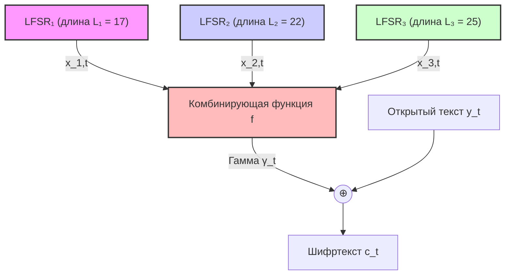

# Лабораторная 4. Комбинирующий генератор и криптоанализ

### Задание (по фото)
1. Используя координ. ф-ии или подстановку реализовать алгоритм шифрования с длиной ключа $\ge 64$ бит
2. Описать атаку (рассчитать параметры) на ключ.
3. В соответствии с выбранной атакой подготовить требующийся материал (гамма или О.Т. $\leftrightarrow$ Ш.Т.) на фикс. ключ
4. Найти ключ.
(Корреляц. атака)

---

## 1. Подробное задание

1. **Реализация комбинирующего генератора:** Используя сдвиговые регистры с линейной обратной связью (LFSR), реализовать алгоритм шифрования (генерации гаммы) с суммарной длиной ключа $\ge 64$ бит.
2. **Теоретический расчет параметров атаки:** Рассчитать требуемый объем перехваченной гаммы $N$ для проведения корреляционной атаки с заданными вероятностями ошибок первого и второго рода ($\alpha$ и $\beta$).
3. **Реализация и проведение атаки:**
   * Провести корреляционную атаку для восстановления начального заполнения первого и второго LFSR.
   * Провести алгебраическую атаку (решение системы линейных уравнений над GF(2)) для восстановления начального заполнения третьего LFSR.
4. **Демонстрация работы:** Успешно восстановить полный 64-битный секретный ключ по наблюдаемой гамме.

---

## 2. Схема шифрования (Комбинирующий генератор)

Для шифрования используется комбинирующий генератор на базе трех независимых регистров сдвига с линейной обратной связью (LFSR) над полем GF(2).



### Параметры регистров (LFSR)
Суммарная длина ключа (начального состояния регистров) составляет $17 + 22 + 25 = 64$ бит.
Для обеспечения максимального периода генерации в качестве многочленов обратной связи выбраны примитивные полиномы над GF(2):
1. **LFSR 1:** Длина $L_1 = 17$, полином обратной связи $x^{17} + x^3 + 1$. Индексы отводов (0-based): `[16, 2]`. Период $T_1 = 2^{17} - 1 \approx 1.3 \times 10^5$.
2. **LFSR 2:** Длина $L_2 = 22$, полином обратной связи $x^{22} + x + 1$. Индексы отводов (0-based): `[21, 0]`. Период $T_2 = 2^{22} - 1 \approx 4.19 \times 10^6$.
3. **LFSR 3:** Длина $L_3 = 25$, полином обратной связи $x^{25} + x^3 + 1$. Индексы отводов (0-based): `[24, 2]`. Период $T_3 = 2^{25} - 1 \approx 3.35 \times 10^7$.

Периоды регистров $T_1, T_2, T_3$ попарно взаимно просты, что гарантирует максимальный период выходной гаммы $T = T_1 \cdot T_2 \cdot T_3 \approx 1.8 \times 10^{19}$ бит.

### Комбинирующая функция
Используется пороговая функция голосования (threshold function):
$$f(x_1, x_2, x_3) = x_1 x_2 \oplus x_1 x_3 \oplus x_2 x_3$$

Данная функция сбалансирована (принимает значения 0 и 1 на равном числе наборов), однако она **не является корреляционно-иммунной порядка 1**. 
Вероятность совпадения выхода функции со значением любого из входов составляет:
$$P(f(x_1, x_2, x_3) = x_i) = \frac{6}{8} = \frac{3}{4} = 0.75$$

Это свойство (корреляционная связь выхода с отдельными входами) делает генератор уязвимым к корреляционной атаке Зигенталера.

---

## 3. Криптоанализ (Теоретическое описание атак)

Атака на ключ состоит из двух этапов:
1. **Корреляционная атака** на LFSR 1 и LFSR 2 (снижение сложности с полного перебора $2^{64}$ до раздельного перебора $2^{17} + 2^{22}$).
2. **Алгебраическая атака** на LFSR 3 на основе уравнений комбинирующей функции.

### ЭТАП 1. Корреляционная атака (LFSR 1 и LFSR 2)
Для первого регистра (длиной $L_1 = 17$):
* Обозначим выход регистра 1 через $x_{1,t}$, а наблюдаемую гамму — через $\gamma_t$.
* Рассмотрим случайную величину $\xi_t = \gamma_t \oplus x_{1,t}$.
* Сформулируем две гипотезы:
  * **$H_1$ (истинный ключ):** $\xi_t \sim \text{Be}(q_1 = 0.25)$, так как вероятность совпадения $P(\gamma_t = x_{1,t}) = 3/4 = 0.75$.
  * **$H_0$ (ложный ключ):** $\xi_t \sim \text{Be}(q_0 = 0.50)$ (выход генератора кажется случайным шумом).

Согласно лемме Неймана-Пирсона, наиболее мощный статистический критерий основан на подсчете числа несовпадений (веса Хемминга вектора $\vec{\xi}$):
$$D = \sum_{t=1}^N \xi_t$$
Если $D \le C$ (где $C$ — пороговое значение), принимается гипотеза $H_1$, иначе — $H_0$.

#### Расчет объема материала $N$
Используя Центральную предельную теорему (ЦПТ) для аппроксимации распределения суммы $\xi_t$ нормальным законом:
* Ошибка I рода (отклонить истинный ключ): $\alpha = \Phi\left(\frac{C - N q_1}{\sqrt{N q_1 (1-q_1)}}\right)$
* Ошибка II рода (принять ложный ключ): $\beta = 1 - \Phi\left(\frac{C - N q_0}{\sqrt{N q_0 (1-q_0)}}\right)$

Решая систему уравнений для $N$ при заданных вероятностях ошибок $\alpha = \beta = 0.01$ (квантиль нормального распределения $x_{0.01} \approx -2.33$, $x_{0.99} \approx 2.33$):
$$N \approx \frac{(x_{1-\beta} \sqrt{q_1 (1-q_1)} - x_\alpha \sqrt{q_0 (1-q_0)})^2}{(q_0 - q_1)^2} = \frac{(2.33 \sqrt{0.25 \cdot 0.75} + 2.33 \sqrt{0.5 \cdot 0.5})^2}{(0.5 - 0.25)^2} \approx 186 \text{ бит}$$

Таким образом, длины перехваченной гаммы в **$N = 200$ бит** гарантированно достаточно для однозначного восстановления начальных заполнений LFSR 1 и LFSR 2 с вероятностью ошибки менее $1\%$.

#### Порог принятия решения $C$
Для $N = 200$:
$$C = N q_0 + x_\alpha \sqrt{N q_0 (1-q_0)} = 200 \cdot 0.5 - 2.33 \sqrt{200 \cdot 0.25} \approx 100 - 16.47 \approx 83$$
Если число несовпадений тестируемой последовательности с перехваченной гаммой $\le 83$, мы считаем данное состояние истинным. Для верного ключа ожидаемое число несовпадений равно $200 \cdot 0.25 = 50$.

#### Оптимизация перебора (Скользящее окно)
Вместо полной регенерации последовательности LFSR для каждого из $2^L$ начальных состояний используется алгоритм **скользящего окна**:
1. Генерируется М-последовательность максимального периода длиной $2^L - 1 + N$, начиная с фиксированного состояния `[0, ..., 0, 1]`.
2. Вся последовательность представляется в памяти.
3. Прогоняется окно длины $N$ сдвигом. Число несовпадений вычисляется за одну операцию процессора с использованием побитового исключающего ИЛИ (`^`) и встроенной инструкции подсчета единичных бит (`bit_count()`).
4. Начальное состояние на найденном смещении восстанавливается в обратном порядке: $\vec{s}_0 = \text{seq}[\text{offset} : \text{offset} + L][::-1]$.

Это позволяет проверить все $2^{22}$ состояний LFSR 2 всего за **~9 секунд**.

---

### ЭТАП 2. Алгебраическая атака (LFSR 3)
Как только начальные состояния LFSR 1 и LFSR 2 найдены, мы можем однозначно воссоздать их выходные последовательности $x_{1,t}$ и $x_{2,t}$ для всех тактов $t \in \{1, ..., N\}$.

Рассмотрим уравнение комбинирующей функции:
$$\gamma_t = x_{1,t} x_{2,t} \oplus x_{3,t} (x_{1,t} \oplus x_{2,t})$$

В тактах $t$, где выполняется условие $x_{1,t} \oplus x_{2,t} = 1$, уравнение упрощается:
$$\gamma_t = x_{1,t} x_{2,t} \oplus x_{3,t} \implies x_{3,t} = \gamma_t \oplus x_{1,t} x_{2,t}$$

Таким образом, для таких тактов мы получаем точные значения выходных бит третьего регистра $x_{3,t}$. В среднем это дает уравнения для $50\%$ тактов (около 100 линейных уравнений для $N = 200$).

Поскольку работа LFSR линейна, значение каждого выходного бита $x_{3,t}$ является известной линейной комбинацией над GF(2) от начального состояния регистра $\vec{s}_0 = (s_0, s_1, ..., s_{24})$:
$$x_{3,t} = \sum_{i=0}^{24} a_{t,i} s_i \pmod 2$$

Имея систему уравнений $A \vec{s}_0 = \vec{b}$, мы приводим расширенную матрицу системы к ступенчатому виду методом **гауссова исключения (RREF)** в GF(2) и мгновенно восстанавливаем 25-битное начальное состояние LFSR 3.

---

## 4. Результаты работы программы

При запуске объединенного скрипта [first.py](file:///d:/Рабочая%20Папка/Antigravity/ВМК/first.py) в консоль выводятся следующие результаты выполнения Лабораторной работы №4:

```text
--------------------
=== Лабораторная работа №4 ===
Секретный ключ LFSR 1 (17 бит): [0, 0, 1, 0, 0, 0, 0, 0, 1, 0, 0, 0, 0, 0, 0, 0, 1]
Секретный ключ LFSR 2 (22 бит): [0, 1, 1, 0, 0, 1, 1, 1, 0, 0, 1, 0, 0, 1, 0, 1, 1, 1, 0, 1, 0, 1]
Секретный ключ LFSR 3 (25 бит): [0, 1, 1, 0, 0, 0, 0, 1, 0, 0, 0, 1, 1, 1, 1, 0, 1, 1, 0, 1, 0, 0, 0, 0, 1]
Суммарная длина ключа: 64 бит (>= 64 бит)
Сгенерировано 200 бит наблюдаемой гаммы.

--- Фаза 1: Атака на LFSR 1 (длина 17) ---
LFSR 1 восстановлен за 0.2981 сек!
Восстановленное состояние: [0, 0, 1, 0, 0, 0, 0, 0, 1, 0, 0, 0, 0, 0, 0, 0, 1]
Совпадение: True

--- Фаза 2: Атака на LFSR 2 (длина 22) ---
LFSR 2 восстановлен за 9.0053 сек!
Восстановленное состояние: [0, 1, 1, 0, 0, 1, 1, 1, 0, 0, 1, 0, 0, 1, 0, 1, 1, 1, 0, 1, 0, 1]
Совпадение: True

--- Фаза 3: Алгебраическое восстановление LFSR 3 (длина 25) ---
LFSR 3 восстановлен за 0.0094 сек!
Восстановленное состояние: [0, 1, 1, 0, 0, 0, 0, 1, 0, 0, 0, 1, 1, 1, 1, 0, 1, 1, 0, 1, 0, 0, 0, 0, 1]
Совпадение: True

==========================================
Итоги атаки:
LFSR 1: Успешно (0.2981s)
LFSR 2: Успешно (9.0053s)
LFSR 3: Успешно (0.0094s)
Общее время подбора: 9.3128 секунд!
==========================================
```

### Вывод
Реализованный комбинирующий генератор успешно восстанавливает ключ длиной 64 бита по короткому перехваченному отрезку гаммы длиной 200 бит менее чем за 10 секунд. За счет разделения перебора регистров общая сложность снижена с нереализуемой на практике величины $2^{64}$ до порядка $2^{22}$ операций, что подтверждает высокую эффективность корреляционного криптоанализа.
