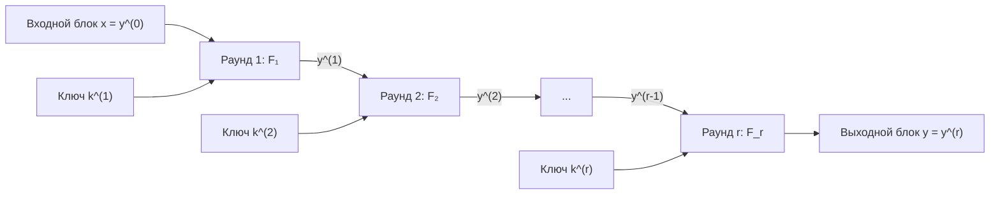
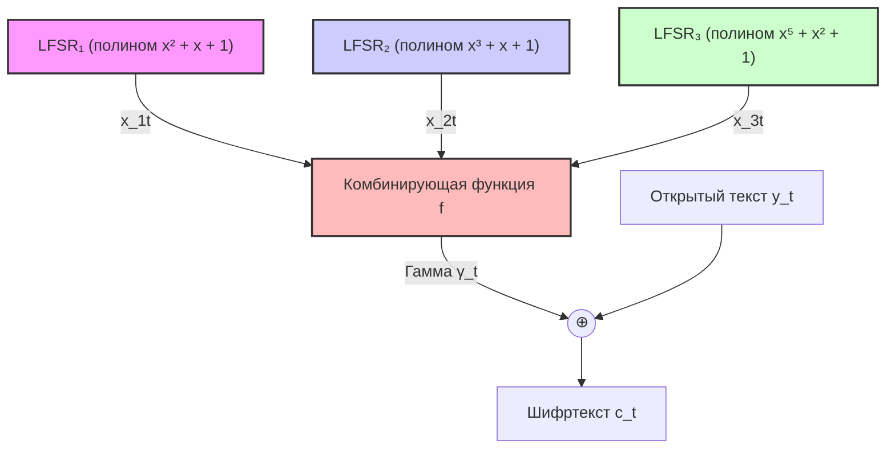

# Лекции по теории вероятностей

## Глава 1. Предварительные сведения из теории вероятностей

### §1. Вероятностное пространство

**Определение:** Тройка $(\Omega, \mathcal{A}, P)$ — **вероятностное пространство**.
* Множество $\Omega$ — пространство элементарных событий (исходов).
* Элементы $\omega \in \Omega$ — элементарные события (исходы).

**Замечание:** Класс событий является взаимоисключающим. Зафиксируем некоторый класс подмножеств $\mathcal{A}$ — класс подмножеств $\Omega$.

**Определение:** Класс множеств $\mathcal{A}$ называется **алгеброй (множеств)**, если:
1. $\Omega \in \mathcal{A}$
2. $A, B \in \mathcal{A} \implies (A \cup B) \in \mathcal{A}$
3. $\emptyset \in \mathcal{A}$
4. $A \in \mathcal{A} \implies \bar{A} \in \mathcal{A}$

**Замечание:** Доказывается, что если $A, B \in \mathcal{A}$, то $(A \cap B) \in \mathcal{A}$.

**Определение:** Алгебра $\mathcal{A}$ называется **$\sigma$-алгеброй**, если для любой последовательности множеств $A_1, A_2, \dots, A_n, \dots \in \mathcal{A}$ выполнено:
$$\bigcup_{k=1}^\infty A_k \in \mathcal{A}$$

**Замечание:** Если $\mathcal{A}$ — $\sigma$-алгебра, то $\bigcap_{k=1}^\infty A_k \in \mathcal{A}$.

**Определение:** Случайное событие (событие) — любое подмножество из $\mathcal{A}$. При этом $\emptyset$ — невозможное событие, $\Omega$ — достоверное событие.

**Определение:** Пару $(\Omega, \mathcal{A})$ называют **измеримым пространством**.

**Пример 1.1:** Наименьшим классом подмножеств, являющимся алгеброй, является $\mathcal{A} = \{\emptyset, \Omega\}$.

**Определение:** Числовая функция $P$, определенная на $\sigma$-алгебре событий $\mathcal{A}$, называется **вероятностной мерой (вероятностью)**, если:
1. $P(A) \ge 0 \quad \forall A \in \mathcal{A}$
2. $P(\Omega) = 1$
3. Если $A, B \in \mathcal{A}$ и $A \cap B = \emptyset$, то $P(A \cup B) = P(A) + P(B)$ (аддитивность).
4. Для любой монотонно убывающей последовательности событий $A_1 \supset A_2 \supset \dots \supset A_n \supset \dots \in \mathcal{A}$ такой, что $\bigcap_{k=1}^\infty A_k = \emptyset$, имеет место равенство:
$$\lim_{k\to\infty} P(A_k) = 0 \quad \text{(аксиома непрерывности)}$$

**Определение:** Тройка $(\Omega, \mathcal{A}, P)$ — **вероятностное пространство**.

**Замечание:** Если $\Omega$ не более чем счётно, то говорят о дискретном вероятностном пространстве.

**Замечание:** Будем обозначать объединение событий как сумму, а пересечение — как произведение:
$$A \cup B = A + B, \quad A \cap B = A \cdot B$$

---

### §2. Независимость событий

**Определение:** События $A_1, \dots, A_n \in \mathcal{A}$ называются **независимыми в совокупности**, если для любой комбинации индексов $1 \le i_1 < \dots < i_k \le n$, где $k \in \{2, \dots, n\}$, выполняется:
$$P(A_{i_1} \cdot \dots \cdot A_{i_k}) = P(A_{i_1}) \cdot \dots \cdot P(A_{i_k}) \quad (1.1)$$

**Замечание:** Если условие (1.1) выполняется только при $k = 2$, то события называются **попарно независимыми**.

**Пример 1.2 (Бернштейна):** Из попарной независимости не всегда следует независимость в совокупности.
Пусть имеется правильный тетраэдр, грани которого раскрашены следующим образом: первая — в красный цвет, вторая — в синий, третья — в зеленый, а на четвертую нанесены все три цвета. Рассмотрим события:
* $A_r$ — тетраэдр упал на грань с красным цветом,
* $A_b$ — на грань с синим цветом,
* $A_g$ — на грань с зеленым цветом.

Элементарные исходы: $\Omega = \{\omega_r, \omega_b, \omega_g, \omega_{rbg}\}$.
События:
$$A_r = \{\omega_r, \omega_{rbg}\}, \quad A_b = \{\omega_b, \omega_{rbg}\}, \quad A_g = \{\omega_g, \omega_{rbg}\}$$
Для каждого исхода $\omega \in \Omega$ вероятность $P(\omega) = \frac{1}{4}$. Тогда:
$$P(A_r) = P(A_b) = P(A_g) = \frac{2}{4} = \frac{1}{2}$$
Вычислим вероятности пересечений:
$$P(A_r \cdot A_b) = P(\{\omega_{rbg}\}) = \frac{1}{4} = P(A_r) \cdot P(A_b) = \frac{1}{2} \cdot \frac{1}{2}$$
Аналогично:
$$P(A_g \cdot A_b) = \frac{1}{4}, \quad P(A_r \cdot A_g) = \frac{1}{4}$$
Отсюда следует, что события $A_r, A_b, A_g$ попарно независимы.
Однако вероятность их совместного пересечения:
$$P(A_r \cdot A_g \cdot A_b) = P(\{\omega_{rbg}\}) = \frac{1}{4} \ne P(A_r) \cdot P(A_g) \cdot P(A_b) = \frac{1}{8}$$
Следовательно, события $A_r, A_g, A_b$ не являются независимыми в совокупности.

**Пример 1.3:** Зададим равномерную меру на множестве двоичных векторов длины 3: $\Omega = V_3$, вероятность каждого вектора $P(\vec{x}) = \frac{1}{8} \quad \forall \vec{x} \in V_3$.
Положим:
$$A_1 = \{\vec{x} \in V_3 \mid x_1 = x_2\}$$
$$A_2 = \{\vec{x} \in V_3 \mid x_1 = x_3\}$$
$$A_3 = \{\vec{x} \in V_3 \mid x_2 = x_3\}$$
Каждое из этих событий состоит из 4 векторов. Вероятности равны:
$$P(A_1) = P(A_2) = P(A_3) = \frac{4}{8} = \frac{1}{2}$$
Пересечения:
$$P(A_1 \cdot A_2) = \frac{2}{8} = \frac{1}{4} = P(A_1) \cdot P(A_2) = \frac{1}{2} \cdot \frac{1}{2}$$
Для пар $A_1 \cdot A_3$ и $A_2 \cdot A_3$ аналогично $\implies$ события попарно независимы.
Однако:
$$P(A_1 \cdot A_2 \cdot A_3) = \frac{2}{8} = \frac{1}{4} \ne P(A_1) \cdot P(A_2) \cdot P(A_3) = \frac{1}{8}$$
Следовательно, события не являются независимыми в совокупности.

---

### §3. Независимость классов событий

**Определение:** Классы событий $\mathcal{F}_1, \dots, \mathcal{F}_n$ из $\sigma$-алгебры $\mathcal{A}$ называются **независимыми**, если для любых $1 \le i_1 < \dots < i_k \le n$, где $k \in \{2, \dots, n\}$, и любых событий $A_{i_j} \in \mathcal{F}_{i_j}$ выполняется:
$$P(A_{i_1} \cdot \dots \cdot A_{i_k}) = P(A_{i_1}) \cdot \dots \cdot P(A_{i_k})$$

Предположим, что классы событий $\mathcal{F}_1, \dots, \mathcal{F}_n$ независимы, и мы добавили в один из классов (без ограничения общности в $\mathcal{F}_1$) еще одно событие $A$. Тогда независимость классов сохраняется тогда и только тогда, когда для любого $2 \le r \le n$ и любого набора индексов $\{i_2, \dots, i_r\} \subset \{2, \dots, n\}$ и событий $A_{i_j} \in \mathcal{F}_{i_j}$ выполняется:
$$P(A \cdot A_{i_2} \dots A_{i_r}) = P(A) \cdot P(A_{i_2}) \dots P(A_{i_r}) \quad (1.2)$$

**Теорема 1.4 (о пополнении классов):** Пусть классы событий $\mathcal{F}_1, \dots, \mathcal{F}_n$ из $\sigma$-алгебры $\mathcal{A}$ независимы. Тогда их независимость не нарушится, если в класс $\mathcal{F}_i$ добавить:
1. Невозможное или достоверное событие ($\emptyset$ или $\Omega$);
2. Собственную разность событий из этого класса (т.е. $A \setminus B$, где $A, B \in \mathcal{F}_i$ и $B \subset A$);
3. Событие, противоположное событию из этого класса ($\bar{A}$);
4. Конечное или счётное объединение попарно несовместных событий из этого класса;
5. Предел монотонной последовательности событий из этого класса ($A_1 \supset A_2 \supset \dots$ или $A_1 \subset A_2 \subset \dots$).

**Доказательство:**
1. Для $A = \Omega$ или $A = \emptyset$ выполнение условия (1.2) очевидно.
2. Добавим разность $A = A_1 \setminus B_1$, где $A_1, B_1 \in \mathcal{F}_1$ и $B_1 \subset A_1$.
   $$P(A \cdot A_{i_2} \dots A_{i_r}) = P((A_1 \setminus B_1) \cdot A_{i_2} \dots A_{i_r}) =$$
   $$= P((A_1 \cdot A_{i_2} \dots A_{i_r}) \setminus (B_1 \cdot A_{i_2} \dots A_{i_r})) =$$
   $$= P(A_1 \cdot A_{i_2} \dots A_{i_r}) - P(B_1 \cdot A_{i_2} \dots A_{i_r}) =$$
   $$= P(A_1) P(A_{i_2}) \dots P(A_{i_r}) - P(B_1) P(A_{i_2}) \dots P(A_{i_r}) =$$
   $$= P(A_{i_2}) \dots P(A_{i_r}) (P(A_1) - P(B_1)) =$$
   $$= P(A_{i_2}) \dots P(A_{i_r}) P(A_1 \setminus B_1) = P(A) \cdot P(A_{i_2}) \dots P(A_{i_r}) \implies \text{условие (1.2) выполнено.}$$
3. Из пунктов 1 и 2 следует, что любой набор может быть пополнен сначала множеством $\Omega$, а затем событием $\bar{A} = \Omega \setminus A$ (так как $A \subset \Omega$).
4. Пусть события $B_k$ попарно несовместны. Для $A = \bigsqcup_{k} B_k$, где $B_k \in \mathcal{F}_1$, по свойству счётной аддитивности вероятности имеем:
   $$P(A \cdot A_{i_2} \dots A_{i_r}) = P\left(\left(\bigsqcup_{k} B_k\right) \cdot A_{i_2} \dots A_{i_r}\right) =$$
   $$= P\left(\bigsqcup_{k} (B_k \cdot A_{i_2} \dots A_{i_r})\right) = \sum_{k} P(B_k \cdot A_{i_2} \dots A_{i_r}) =$$
   $$= \sum_{k} P(B_k) P(A_{i_2}) \dots P(A_{i_r}) = P(A_{i_2}) \dots P(A_{i_r}) \sum_{k} P(B_k) =$$
   $$= P(A_{i_2}) \dots P(A_{i_r}) P\left(\bigsqcup_{k} B_k\right) = P(A) \cdot P(A_{i_2}) \dots P(A_{i_r}) \implies \text{условие (1.2) выполнено.}$$
5. Для неубывающей последовательности событий $B_1 \subset B_2 \subset \dots \subset B_k \subset \dots \in \mathcal{F}_1$ и их предела $A = \bigcup_{k=1}^\infty B_k$, по свойству непрерывности вероятностной меры:
   $$P(A \cdot A_{i_2} \dots A_{i_r}) = P\left(\left(\bigcup_{k=1}^\infty B_k\right) \cdot A_{i_2} \dots A_{i_r}\right) = P\left(\left(\lim_{k\to\infty} B_k\right) \cdot A_{i_2} \dots A_{i_r}\right) =$$
   $$= P\left(\lim_{k\to\infty} (B_k \cdot A_{i_2} \dots A_{i_r})\right) = \lim_{k\to\infty} P(B_k \cdot A_{i_2} \dots A_{i_r}) =$$
   $$= \lim_{k\to\infty} (P(B_k) \cdot P(A_{i_2}) \dots P(A_{i_r})) = \left(\lim_{k\to\infty} P(B_k)\right) \cdot P(A_{i_2}) \dots P(A_{i_r}) =$$
   $$= P\left(\bigcup_{k=1}^\infty B_k\right) \cdot P(A_{i_2}) \dots P(A_{i_r}) = P(A) \cdot P(A_{i_2}) \dots P(A_{i_r}) \implies \text{условие (1.2) выполнено. } \square$$

**Пример 1.5:** Зададим равномерную меру на $V_3 = \Omega$, $P(\vec{x}) = \frac{1}{8}$ для любого $\vec{x} \in V_3$.
$$A_1 = \{\vec{x} \in V_3 \mid x_1 = x_2\}$$
$$A_2 = \{\vec{x} \in V_3 \mid x_1 = x_3\}$$
$$A_3 = \{\vec{x} \in V_3 \mid x_2 = x_3\}$$

Рассмотрим классы $\mathcal{F}_1 = \{A_1, A_3\}$ и $\mathcal{F}_2 = \{A_2\}$.
Эти наборы независимы (см. Пример 1.3), но событие $A_1 \cdot A_3 = \{\vec{x} \in V_3 \mid x_1 = x_2 = x_3\}$ и событие $A_2$ зависимы (их пересечение — это вектор $(1,1,1)$ и $(0,0,0)$ с вероятностью $\frac{2}{8} = \frac{1}{4} \neq P(A_1 \cdot A_3) \cdot P(A_2) = \frac{1}{4} \cdot \frac{1}{2} = \frac{1}{8}$). Следовательно, класс $\mathcal{F}_1$ не может быть пополнен событием $A_1 \cdot A_3$ без нарушения независимости.

По п. 3 теоремы 1.4 набор $\mathcal{F}_1$ может быть пополнен $\bar{A}_1$, $\bar{A}_3$ без нарушения независимости. Но их объединение $\bar{A}_1 \cup \bar{A}_3 = \overline{A_1 \cdot A_3} = V_3 \setminus \{(0,0,0), (1,1,1)\}$ и событие $A_2$ зависимы, так как их пересечение не пусто.

**Определение:** Если $\mathcal{F}$ — произвольный класс событий из $\mathcal{A}$, тогда пересечение всех $\sigma$-алгебр, содержащих $\mathcal{F}$ (то есть $\sigma(\mathcal{F}) = \bigcap_{\mathcal{F} \subset \mathcal{A}'} \mathcal{A}'$, где $\mathcal{A}'$ — $\sigma$-алгебра), называется **минимальной $\sigma$-алгеброй, порожденной классом $\mathcal{F}$**.

Тогда, если потребовать от классов замкнутость относительно пересечения, то можно получить следующее следствие:

**Теорема 1.6:** Пусть классы событий $\mathcal{F}_1, \dots, \mathcal{F}_n$ независимы и каждый из них замкнут относительно пересечения. Тогда порождённые ими $\sigma$-алгебры $\sigma(\mathcal{F}_1), \dots, \sigma(\mathcal{F}_n)$ будут также независимыми.

---

## Глава 2. Случайные величины

### §1. Борелевская $\sigma$-алгебра

Рассмотрим множество $\mathbb{R}$. Определим класс множеств, состоящий из всех возможных полуинтервалов:
$$\mathcal{B}_0 = \{(a, b] \mid a, b \in \mathbb{R}\}$$
$\mathcal{B}_0$ не является алгеброй.
Пусть $\mathcal{B}$ — $\sigma$-алгебра, порождённая классом $\mathcal{B}_0$.
$\mathcal{B}$ называется **борелевской $\sigma$-алгеброй**, а её элементы — **борелевскими множествами в $\mathbb{R}$**.

**Пример 1.7:** Борелевскими множествами являются: любая точка $\{c\}$, отрезок $[c, d]$, полуинтервал $(-\infty, c]$, полуинтервал $[c, d)$ и т.д.

---

### §2. Определение случайной величины

Пусть $(\Omega, \mathcal{A}, P)$ — произвольное вероятностное пространство.

**Определение:** Числовая функция $\xi: \Omega \to \mathbb{R}$ называется **случайной величиной**, если для любого $x \in \mathbb{R}$ её полный прообраз множества $(-\infty, x)$ принадлежит $\sigma$-алгебре $\mathcal{A}$:
$$\xi^{-1}((-\infty, x)) = \{\omega \in \Omega \mid \xi(\omega) < x\} \in \mathcal{A}$$

**Замечание:** Если $\mathcal{A} = 2^\Omega$ (булеан $\Omega$), то указанное выше условие выполнено для любой функции $\xi$.

**Утверждение 1.8:** Если случайная величина $\xi$ задана на вероятностном пространстве $(\Omega, \mathcal{A}, P)$, то для любого борелевского множества $B \in \mathcal{B}$ выполняется:
$$\xi^{-1}(B) = \{\omega \in \Omega \mid \xi(\omega) \in B\} \in \mathcal{A}$$
(Доказательство следует из определения $\sigma$-алгебры и борелевской $\sigma$-алгебры $\mathcal{B}$).

**Замечание:** $P_\xi$ — вероятностная мера (распределение вероятностей случайной величины).

**Определение:** **Функцией распределения** случайной величины $\xi$ называется функция $F_\xi(x) = P(\{\omega \in \Omega \mid \xi(\omega) < x\}) = P\{\xi < x\}$, действующая из $\mathbb{R}$ в $[0, 1]$.

**Лемма 1.1:** Пусть случайная величина $\xi$ задана на вероятностном пространстве $(\Omega, \mathcal{A}, P)$. Тогда $\sigma$-алгеброй является следующий класс событий:
$$\mathcal{F} = \{\xi^{-1}(B) \mid B \in \mathcal{B}\} \subset \mathcal{A}$$
*Доказательство:* Доказательство очевидно. Для любой теоретико-множественной операции $* \in \{\setminus, \cap, \cup\}$ и любых $A, B \in \mathcal{B}$ выполнено:
$$\xi^{-1}(A \setminus B) = \xi^{-1}(A) \setminus \xi^{-1}(B)$$
Действительно:
$$\omega \in \xi^{-1}(A \setminus B) \iff \xi(\omega) \in (A \setminus B) \iff (\xi(\omega) \in A) \land (\xi(\omega) \notin B) \iff$$
$$\iff (\omega \in \xi^{-1}(A)) \land (\omega \notin \xi^{-1}(B)) \iff \omega \in \xi^{-1}(A) \setminus \xi^{-1}(B)$$
Для операций $\cap$ и $\cup$ доказательство аналогично. $\square$

**Определение:** Пусть случайная величина $\xi$ определена на вероятностном пространстве $(\Omega, \mathcal{A}, P)$. Тогда совокупность множеств:
$$\sigma(\xi) = \{\xi^{-1}(B) \mid B \in \mathcal{B}\} \subset \mathcal{A}$$
называется **$\sigma$-алгеброй событий, порожденной случайной величиной $\xi$**.

Если множество значений $\xi(\Omega)$ конечно, то случайная величина называется **простой**.

**Пример 1.9:** Пусть $A \in \mathcal{A}$. Тогда случайная величина $I_A(\omega) = \begin{cases} 1, & \omega \in A \\ 0, & \omega \notin A \end{cases}$ называется **индикаторной случайной величиной** (индикатором события $A$). Она дискретна и проста.

Для дискретной случайной величины $\xi$ события $H_k = \xi^{-1}(\{x_k\}) = \{\omega \in \Omega \mid \xi(\omega) = x_k\}$, где $k \in \mathbb{N}$ (или конечный набор), образуют не более чем счётное разбиение нашего пространства элементарных событий $\Omega$. Далее будем называть его **разбиением, порождённым случайной величиной $\xi$**, и обозначать как $H(\xi)$.

Для любого $B \in \mathcal{B}$ выполнено:
$$\xi^{-1}(B) = \bigsqcup_{k: x_k \in B} H_k$$
и можно показать, что наша $\sigma(\xi)$ является $\sigma$-алгеброй, порождённой разбиением $H(\xi)$.

Обозначим $p_k = P\{\xi = x_k\} \ge 0$, $k \in \mathbb{N}$, $\sum_{k \in \mathbb{N}} p_k = 1$. Тогда таблица распределения случайной величины $\xi$ имеет вид:
$$\xi \sim \begin{pmatrix} x_1 & x_2 & \dots & x_k & \dots \\ p_1 & p_2 & \dots & p_k & \dots \end{pmatrix}$$
Она полностью определяет распределение случайной величины $\xi$.

**Пример 1.10:** Индикаторная случайная величина $\xi = I_A(\omega)$ имеет распределение Бернулли:
$$\xi \sim \text{Be}(p) \sim \begin{pmatrix} 0 & 1 \\ 1-p & p \end{pmatrix}, \quad \text{где } p = P(A)$$
При этом:
$$\xi^{-1}(B) = \begin{cases} \emptyset, & B \cap \{0, 1\} = \emptyset \\ \bar{A}, & B \cap \{0, 1\} = \{0\} \\ A, & B \cap \{0, 1\} = \{1\} \\ \Omega, & B \cap \{0, 1\} = \{0, 1\} \end{cases}$$
Функция распределения:
$$F_\xi(x) = P\{\xi < x\} = \begin{cases} 0, & x \le 0 \\ q, & 0 < x \le 1 \\ 1, & x > 1 \end{cases} \quad \text{где } q = 1-p$$
Таким образом, $\sigma$-алгебра $\sigma(\xi) = \{\emptyset, \bar{A}, A, \Omega\}$ порождена разбиением $H(\xi) = \{\bar{A}, A\}$.

---

### §3. Независимость случайных величин

**Определение:** Пусть задано вероятностное пространство $(\Omega, \mathcal{A}, P)$. Случайные величины $\xi_1, \dots, \xi_n$ называются **независимыми (в совокупности)**, если для любых борелевских множеств $B_1, \dots, B_n \in \mathcal{B}$ выполняется:
$$P\{\xi_1 \in B_1, \dots, \xi_n \in B_n\} = P\{\xi_1 \in B_1\} \dots P\{\xi_n \in B_n\}$$

**Замечание:** Независимость случайных величин эквивалентна независимости порождённых ими $\sigma$-алгебр $\sigma(\xi_1), \dots, \sigma(\xi_n)$.

**Теорема 1.11 (критерий независимости индикаторов):** Индикаторы $\xi_1, \dots, \xi_n$ независимы тогда и только тогда, когда для всех комбинаций индексов $1 \le i_1 < \dots < i_k \le n$, где $k \in \{2, \dots, n\}$, выполняется:
$$P\{\xi_{i_1} = 1, \dots, \xi_{i_k} = 1\} = P\{\xi_{i_1} = 1\} \dots P\{\xi_{i_k} = 1\} \quad (1.3)$$
*Доказательство:*
$\square$ Пусть $A_i = \xi_i^{-1}(\{1\})$, тогда $\bar{A}_i = \xi_i^{-1}(\{0\})$. Условие (1.3) эквивалентно независимости одноэлементных классов событий $\mathcal{F}_i = \{A_i\}$. Условие независимости индикаторов эквивалентно независимости классов $\sigma(\xi_i) = \{\emptyset, \bar{A}_i, A_i, \Omega\}$, где $i \in \{1, \dots, n\}$.
Из включения $\mathcal{F}_i \subset \sigma(\xi_i)$ сразу следует необходимость условия (1.3).
Достаточность (1.3) вытекает из возможности пополнения классов $\mathcal{F}_i$ событиями $\emptyset, \Omega, \bar{A}_i$ без потери независимости (по теореме 1.4). $\square$

**Следствие 1.12:** Индикаторы $\xi_1, \dots, \xi_n$ независимы тогда и только тогда, когда существует набор $(\alpha_1, \dots, \alpha_n) \in V_n$ такой, что для всех комбинаций индексов $1 \le i_1 < \dots < i_k \le n$, где $k \in \{2, \dots, n\}$, выполняется:
$$P\{\xi_{i_1} = \alpha_{i_1}, \dots, \xi_{i_k} = \alpha_{i_k}\} = P\{\xi_{i_1} = \alpha_{i_1}\} \dots P\{\xi_{i_k} = \alpha_{i_k}\}$$

**Утверждение 1.13:** Случайные величины $\xi_1, \dots, \xi_n$ со значениями в дискретном множестве $Y$ независимы тогда и только тогда, когда для любых $y_1, \dots, y_n \in Y$:
$$P\{\xi_1 = y_1, \dots, \xi_n = y_n\} = P\{\xi_1 = y_1\} \dots P\{\xi_n = y_n\} \quad (1.5)$$

*Доказательство:* Так как одноточечное подмножество $B_i = \{y_i\}$ является борелевским, то условие (1.5) является необходимым условием независимости.
Докажем достаточность. Если просуммировать (1.5) по всем значениям одной из случайных величин, то она исчезнет из левой и правой частей равенства. Таким образом, (1.5) эквивалентно следующему условию: для любого набора индексов $1 \le i_1 < \dots < i_k \le n$, где $k \in \{2, \dots, n\}$, выполняется:
$$P\{\xi_{i_1} = y_{i_1}, \dots, \xi_{i_k} = y_{i_k}\} = P\{\xi_{i_1} = y_{i_1}\} \dots P\{\xi_{i_k} = y_{i_k}\}$$
А это условие, в свою очередь, эквивалентно независимости классов событий $\mathcal{F}_i = \{\xi_i^{-1}(\{y\}) \mid y \in Y\} \cup \{\emptyset\}$, $i \in \{1, \dots, n\}$, которые замкнуты относительно пересечения и порождают $\sigma$-алгебры $\sigma(\xi_i)$. Тогда по теореме 1.6 порождённые $\sigma$-алгебры $\sigma(\xi_1), \dots, \sigma(\xi_n)$ будут независимыми, следовательно, случайные величины независимы. $\square$

**Замечание:** Вообще говоря, Утверждение 1.13 верно и для случайных векторов.

**Формулировка:** Случайные векторы $\vec{\xi}_1, \dots, \vec{\xi}_n$, компоненты которых принимают значения из дискретного множества $Y$, независимы тогда и только тогда, когда для любых $\vec{y}_1, \dots, \vec{y}_n \in Y$:
$$P\{\vec{\xi}_1 = \vec{y}_1, \dots, \vec{\xi}_n = \vec{y}_n\} = P\{\vec{\xi}_1 = \vec{y}_1\} \dots P\{\vec{\xi}_n = \vec{y}_n\}$$

**Теорема 1.15:** Если $\xi_1, \dots, \xi_n$ — независимые случайные величины, а $g_1(x), \dots, g_n(x)$ — борелевские функции, то случайные величины $\eta_1 = g_1(\xi_1), \dots, \eta_n = g_n(\xi_n)$ также независимы.

*Доказательство:* Для любых борелевских множеств $B_1, \dots, B_n \in \mathcal{B}$ события $A_k = \eta_k^{-1}(B_k) = \xi_k^{-1}(g_k^{-1}(B_k))$ имеют вид $A_k = \xi_k^{-1}(C_k)$, где $C_k = g_k^{-1}(B_k)$ — борелевские множества, $k \in \{1, \dots, n\}$. Независимость событий $A_1, \dots, A_n$ следует напрямую из независимости случайных величин $\xi_1, \dots, \xi_n$. $\square$

---

### §4. Математическое ожидание, дисперсия, ковариация, коэффициент корреляции

Ограничимся дискретным случаем.

**Определение:** Если случайная величина $\xi: \Omega \to \mathbb{R}$ определена на дискретном вероятностном пространстве $(\Omega, \mathcal{A}, P)$, и хотя бы одна из сумм:
$$S_+(\xi) = \sum_{\omega \in \Omega, \xi(\omega) \ge 0} \xi(\omega) P(\omega) \ge 0$$
$$S_-(\xi) = \sum_{\omega \in \Omega, \xi(\omega) < 0} \xi(\omega) P(\omega) \le 0$$
конечна, то **математическим ожиданием** случайной величины $\xi$ называется величина:
$$M\xi = S_+(\xi) + S_-(\xi)$$

**Замечание:** Математическое ожидание $M\xi$ конечно тогда и только тогда, когда обе суммы $S_+(\xi)$ и $S_-(\xi)$ конечны. При этом справедливо:
$$M\xi = \sum_{\omega \in \Omega} \xi(\omega) P(\omega)$$

#### Свойства математического ожидания
1. Если $|M\xi_1| < +\infty, \dots, |M\xi_n| < +\infty$, то:
   $$M(\xi_1 + \dots + \xi_n) = M\xi_1 + \dots + M\xi_n$$
2. Если случайные величины $\xi_1, \dots, \xi_n$ независимы, то:
   $$M(\xi_1 \dots \xi_n) = M\xi_1 \dots M\xi_n$$

**Пример 1.16:** Найдем математическое ожидание $\xi \sim \text{Bi}(n, p)$ (биномиальное распределение). Такое распределение имеет случайная величина, равная числу успехов в $n$ независимых испытаниях Бернулли, если $\xi_1, \dots, \xi_n$ независимы и $\xi_i \sim \text{Be}(p)$, $i \in \{1, \dots, n\}$.
Тогда $\xi = \xi_1 + \dots + \xi_n$.
По определению:
$$P\left\{\sum_{i=1}^n \xi_i = k\right\} = C_n^k p^k (1-p)^{n-k} = P\{\xi = k\}$$
Учитывая, что $M\xi_i = 0 \cdot (1-p) + 1 \cdot p = p$, получим:
$$M\xi = M\left(\sum_{i=1}^n \xi_i\right) = \sum_{i=1}^n M\xi_i = \sum_{i=1}^n p = np$$

**Определение:** **Дисперсией** случайной величины $\xi$ называется число:
$$D\xi = M(\xi - M\xi)^2$$

**Замечание:** Справедливо равенство:
$$D\xi = M\xi^2 - (M\xi)^2$$

**Замечание:** Пусть $\xi_1, \dots, \xi_n$ — независимые случайные величины, а $a_1, \dots, a_n \in \mathbb{R}$. Тогда:
$$D(a_1\xi_1 + \dots + a_n\xi_n) = a_1^2 D\xi_1 + \dots + a_n^2 D\xi_n$$

**Определение:** Пусть случайные величины $\xi$ и $\eta$ заданы на одном вероятностном пространстве, причем $|M\xi| < +\infty$ и $|M\eta| < +\infty$. Тогда **ковариацией** случайных величин $\xi$ и $\eta$ называют величину:
$$\text{cov}(\xi, \eta) = M((\xi - M\xi)(\eta - M\eta))$$

**Замечание:** Справедливо равенство:
$$\text{cov}(\xi, \eta) = M(\xi\eta) - M\xi \cdot M\eta$$

**Определение:** Если, кроме того, $D\xi < +\infty$ и $D\eta < +\infty$, то **коэффициентом корреляции** называется число:
$$\rho(\xi, \eta) = \frac{\text{cov}(\xi, \eta)}{\sqrt{D\xi \cdot D\eta}}$$

**Замечание:** Если $\rho(\xi, \eta) = 0$ (или ковариация равна 0), то случайные величины называются **некоррелированными**.

---

## Глава 2. Двоичные случайные векторы

### §1. Преобладание индикаторных случайных величин

Пусть задано вероятностное пространство $(\Omega, \mathcal{A}, P)$.

**Замечание:** В общем случае из независимости случайных величин следует их некоррелируемость, но не наоборот.

**Пример 2.1:** Пусть $\xi \sim \begin{pmatrix} -1 & 0 & 1 \\ 1/3 & 1/3 & 1/3 \end{pmatrix}$ и $\eta = \xi^2 \sim \begin{pmatrix} 0 & 1 \\ 1/3 & 2/3 \end{pmatrix}$.
Покажем, что $\xi$ и $\eta$ некоррелируемы, но зависимы:
$$M\xi = (-1) \cdot \frac{1}{3} + 0 \cdot \frac{1}{3} + 1 \cdot \frac{1}{3} = 0$$
$$M\eta = 0 \cdot \frac{1}{3} + 1 \cdot \frac{2}{3} = \frac{2}{3}$$
$$M(\xi\eta) = M(\xi^3) = M\xi = 0 \implies \text{cov}(\xi, \eta) = M(\xi\eta) - M\xi \cdot M\eta = 0 - 0 \cdot \frac{2}{3} = 0$$
Следовательно, $\xi$ и $\eta$ некоррелируемы.
Однако:
$$P\{\xi = 0, \eta = 1\} = P\{\xi = 0, \xi^2 = 1\} = 0 \neq P\{\xi = 0\} \cdot P\{\eta = 1\} = \frac{1}{3} \cdot \frac{2}{3} = \frac{2}{9}$$
Следовательно, они зависимы.

**Утверждение 2.2:** Индикаторные случайные величины $\xi$ and $\eta$ независимы тогда и только тогда, когда они некоррелируемы (т.е. $\text{cov}(\xi, \eta) = 0$).

*Доказательство:* Некоррелируемость эквивалентна равенству $M(\xi\eta) = M\xi \cdot M\eta$. Для индикаторных величин это переписывается как:
$$P\{\xi = 1, \eta = 1\} = P\{\xi = 1\} \cdot P\{\eta = 1\}$$
что в силу Теоремы 1.11 эквивалентно их независимости. $\square$

**Утверждение 2.3:** Пусть случайная величина $\xi$ принимает не более двух значений (т.е. $\xi(\Omega) \subset \{a, b\}$), и случайная величина $\eta$ также принимает не более двух значений (т.е. $\eta(\Omega) \subset \{c, d\}$). Тогда условие некоррелируемости случайных величин $\xi$ и $\eta$ эквивалентно условию их независимости.

**Определение:** **Преобладанием (нулей над единицами)** в распределении индикаторной случайной величины $\xi$ называется число:
$$d(\xi) = P\{\xi = 0\} - P\{\xi = 1\}$$

**Замечание:** Справедливы формулы:
$$d(\xi) = 2P\{\xi = 0\} - 1 = 1 - 2P\{\xi = 1\}$$
При этом $d(\xi) \in [-1, 1]$, причем крайние значения $d(\xi) = \pm 1$ возможны только для константных случайных величин (почти наверное констант 0 или 1).

Преобладание полностью определяет распределение индикаторной случайной величины:
$$\xi \sim \begin{pmatrix} 0 & 1 \\ \frac{1}{2}(1 + d(\xi)) & \frac{1}{2}(1 - d(\xi)) \end{pmatrix}$$

**Замечание:** $d(\xi \oplus 1) = -d(\xi)$.

Каждый индикатор $\xi$ линейно связан со случайной величиной $(-1)^\xi$:
$$(-1)^\xi = 1 - 2\xi, \quad \xi = \frac{1}{2}(1 - (-1)^\xi)$$
Очевидно, что:
$$(-1)^\xi \sim \begin{pmatrix} -1 & 1 \\ \frac{1}{2}(1 - d(\xi)) & \frac{1}{2}(1 + d(\xi)) \end{pmatrix}$$
Тогда:
$$M(-1)^\xi = d(\xi), \quad D(-1)^\xi = 1 - d^2(\xi) \quad (2.1)$$

**Определение:** Индикатор $\xi$ называется **сбалансированным**, если $P\{\xi = 0\} = P\{\xi = 1\} = \frac{1}{2}$.

**Замечание:** Сбалансированность эквивалентна тому, что $d(\xi) = 0$ или $M(-1)^\xi = 0$.

**Замечание:** Для двух индикаторов $\xi$ и $\eta$ можно рассматривать преобладание (равенства над неравенством) между $\xi$ и $\eta$:
$$d(\xi \oplus \eta) = P\{\xi = \eta\} - P\{\xi \neq \eta\} = M(-1)^{\xi \oplus \eta} = M(-1)^{\xi + \eta} = M((-1)^\xi (-1)^\eta)$$
Отсюда следует:
$$\text{cov}((-1)^\xi, (-1)^\eta) = d(\xi \oplus \eta) - d(\xi) \cdot d(\eta)$$
Если хотя бы один индикатор сбалансирован, то:
$$\text{cov}((-1)^\xi, (-1)^\eta) = d(\xi \oplus \eta)$$

**Утверждение 2.4:** Индикаторные случайные величины $\xi$ и $\eta$ независимы тогда и только тогда, когда $d(\xi \oplus \eta) = d(\xi) \cdot d(\eta)$.

---

### §2. Дискретные характеристические функции (ДХФ)

Пусть $(\Omega, \mathcal{A}, P)$ — вероятностное пространство.

**Определение:** **Комплексной случайной величиной** называется функция $\xi_1(\omega) + i \xi_2(\omega)$, где $\omega \in \Omega$, а $\xi_1, \xi_2$ — случайные величины, заданные на $(\Omega, \mathcal{A}, P)$.
По определению:
$$M(\xi_1 + i \xi_2) = M\xi_1 + i M\xi_2$$

Для исследования распределения произвольной (действительной) случайной величины $\xi$ вводят понятие **характеристической функции**:
$$f_\xi(t) = M e^{i t \xi}, \quad t \in \mathbb{R}$$
Если $\xi$ — дискретная случайная величина, то справедливо:
$$f_\xi(t) = \sum_{\omega \in \Omega} e^{i t \xi(\omega)} P(\omega)$$

Аналогично характеристическую функцию определяют для случайного вектора:
$$f_{\vec{\xi}}(\vec{t}) = M \exp(i \langle\vec{\xi}, \vec{t}\rangle)$$
где $\langle\vec{\xi}, \vec{t}\rangle = \sum_{i=1}^n \xi_i t_i$ — скалярное произведение.

Рассмотрим случай, когда случайные величины принимают $m$ значений (от $0$ до $m-1$).

**Определение:** **Дискретной характеристической функцией (ДХФ)** случайного вектора $\vec{\xi} = (\xi_1, \dots, \xi_n): \Omega \to \mathbb{Z}_m^n$ называется функция $\varphi_{\vec{\xi}}(\vec{u}): \mathbb{Z}_m^n \to \mathbb{C}$, заданная формулой:
$$\varphi_{\vec{\xi}}(\vec{u}) = M \exp\left(\frac{2\pi i}{m} \langle\vec{u}, \vec{\xi}\rangle\right) = M \exp\left(\frac{2\pi i}{m} \sum_{k=1}^n u_k \xi_k\right) = \sum_{\vec{v} \in \mathbb{Z}_m^n} P\{\vec{\xi} = \vec{v}\} \exp\left(\frac{2\pi i}{m} \langle\vec{u}, \vec{v}\rangle\right)$$
где $\langle\vec{u}, \vec{v}\rangle$ — скалярное произведение.

**Замечание:** При изменении любой координаты вектора $\vec{u}$ или $\vec{\xi}$ на величину, кратную $m$, значение $\exp\left(\frac{2\pi i}{m} \langle\vec{u}, \vec{\xi}\rangle\right)$ не изменяется. Поэтому все операции в скалярном произведении проводим по модулю $m$.

**Замечание:** ДХФ связана с обычной характеристической функцией соотношением:
$$\varphi_{\vec{\xi}}(\vec{u}) = f_{\vec{\xi}}\left(\frac{2\pi}{m} \vec{u}\right)$$

**Теорема 2.5:** Выполняются следующие свойства ДХФ:
1. *Ограниченность:* $|\varphi_{\vec{\xi}}(\vec{u})| \le \varphi_{\vec{\xi}}(\vec{0}) = 1$.
2. Изменение знака всех координат случайного вектора меняет ДХФ на сопряжённую:
   $$\varphi_{-\vec{\xi}}(\vec{u}) = \varphi_{\vec{\xi}}(-\vec{u}) = \overline{\varphi_{\vec{\xi}}(\vec{u})}, \quad \vec{u} \in \mathbb{Z}_m^n$$
3. Если случайные векторы $\vec{\xi}$ и $\vec{\eta}$ независимы, то:
   $$\varphi_{\vec{\xi} + \vec{\eta}}(\vec{u}) = \varphi_{\vec{\xi}}(\vec{u}) \cdot \varphi_{\vec{\eta}}(\vec{u})$$
4. Если компоненты случайного вектора $\vec{\xi} = (\xi_1, \dots, \xi_n)$ независимы, то:
   $$\varphi_{\vec{\xi}}(\vec{u}) = \varphi_{\xi_1}(u_1) \dots \varphi_{\xi_n}(u_n)$$

*Доказательство:*
1. $|\varphi_{\vec{\xi}}(\vec{u})| = \left|M \exp\left(\frac{2\pi i}{m} \langle\vec{\xi}, \vec{u}\rangle\right)\right| \le M \left|\exp\left(\frac{2\pi i}{m} \langle\vec{\xi}, \vec{u}\rangle\right)\right| = M(1) = 1$, при этом $\varphi_{\vec{\xi}}(\vec{0}) = M(1) = 1$.
2. Воспользуемся свойствами скалярного произведения и тригонометрическими функциями:
   $$\varphi_{-\vec{\xi}}(\vec{u}) = M \exp\left(\frac{2\pi i}{m} \langle-\vec{\xi}, \vec{u}\rangle\right) = M \exp\left(-\frac{2\pi i}{m} \langle\vec{\xi}, \vec{u}\rangle\right) =$$
   $$= M\left(\cos\left(-\frac{2\pi}{m}\langle\vec{\xi}, \vec{u}\rangle\right) + i \sin\left(-\frac{2\pi}{m}\langle\vec{\xi}, \vec{u}\rangle\right)\right) = M\left(\cos\left(\frac{2\pi}{m}\langle\vec{\xi}, \vec{u}\rangle\right) - i \sin\left(\frac{2\pi}{m}\langle\vec{\xi}, \vec{u}\rangle\right)\right) = \overline{\varphi_{\vec{\xi}}(\vec{u})}$$
   Для $\varphi_{\vec{\xi}}(-\vec{u})$ доказательство аналогично.
3. $\varphi_{\vec{\xi} + \vec{\eta}}(\vec{u}) = M \exp\left(\frac{2\pi i}{m} \langle\vec{\xi} + \vec{\eta}, \vec{u}\rangle\right) = M \exp\left(\frac{2\pi i}{m} (\langle\vec{\xi}, \vec{u}\rangle + \langle\vec{\eta}, \vec{u}\rangle)\right) = M\left(\exp\left(\frac{2\pi i}{m} \langle\vec{\xi}, \vec{u}\rangle\right) \cdot \exp\left(\frac{2\pi i}{m} \langle\vec{\eta}, \vec{u}\rangle\right)\right) =$
   $$= M \exp\left(\frac{2\pi i}{m} \langle\vec{\xi}, \vec{u}\rangle\right) \cdot M \exp\left(\frac{2\pi i}{m} \langle\vec{\eta}, \vec{u}\rangle\right) = \varphi_{\vec{\xi}}(\vec{u}) \cdot \varphi_{\vec{\eta}}(\vec{u})$$
4. Доказывается аналогично свойству 3 индукцией по числу независимых компонент. $\square$

---

### §3. Формула обращения ДХФ

**Теорема 2.6 (формула обращения):** Если $\vec{\xi}(\Omega) \subset \mathbb{Z}_m^n$, то для любого $\vec{b} \in \mathbb{Z}_m^n$:
$$P\{\vec{\xi} = \vec{b}\} = \frac{1}{m^n} \sum_{\vec{u} \in \mathbb{Z}_m^n} \varphi_{\vec{\xi}}(\vec{u}) \exp\left(-\frac{2\pi i}{m} \langle\vec{u}, \vec{b}\rangle\right) \quad (2.2)$$

*Доказательство:*
$\square$ Зафиксируем $\vec{b} = (b_1, \dots, b_n) \in \mathbb{Z}_m^n$. Подставим в правую часть выражение для ДХФ:
$$\sum_{\vec{u} \in \mathbb{Z}_m^n} \varphi_{\vec{\xi}}(\vec{u}) \exp\left(-\frac{2\pi i}{m} \langle\vec{u}, \vec{b}\rangle\right) = \sum_{\vec{u} \in \mathbb{Z}_m^n} \left(\sum_{\vec{c} \in \mathbb{Z}_m^n} P\{\vec{\xi} = \vec{c}\} \exp\left(\frac{2\pi i}{m} \langle\vec{u}, \vec{c}\rangle\right)\right) \exp\left(-\frac{2\pi i}{m} \langle\vec{u}, \vec{b}\rangle\right) =$$
$$= \sum_{\vec{c} \in \mathbb{Z}_m^n} P\{\vec{\xi} = \vec{c}\} \sum_{\vec{u} \in \mathbb{Z}_m^n} \exp\left(\frac{2\pi i}{m} \langle\vec{u}, \vec{c} - \vec{b}\rangle\right) =$$
$$= \sum_{\vec{c} \in \mathbb{Z}_m^n} P\{\vec{\xi} = \vec{c}\} \left( \sum_{u_1 \in \mathbb{Z}_m} \exp\left(\frac{2\pi i}{m} u_1(c_1 - b_1)\right) \dots \sum_{u_n \in \mathbb{Z}_m} \exp\left(\frac{2\pi i}{m} u_n(c_n - b_n)\right) \right)$$
Рассмотрим одномерную сумму $\sum_{u_k=0}^{m-1} \exp\left(\frac{2\pi i}{m} u_k \cdot a\right)$ для некоторого целого $a$:
* Если $a \not\equiv 0 \pmod m$, то $z = \exp\left(\frac{2\pi i}{m} a\right) \neq 1$, и мы имеем сумму геометрической прогрессии:
  $$1 + z + z^2 + \dots + z^{m-1} = \frac{z^m - 1}{z - 1} = \frac{\exp(2\pi i a) - 1}{z - 1} = 0$$
* Если $a \equiv 0 \pmod m$, то $z = 1$, и сумма равна $m$.

Следовательно,
$$\sum_{\vec{u} \in \mathbb{Z}_m^n} \exp\left(\frac{2\pi i}{m} \langle\vec{u}, \vec{c} - \vec{b}\rangle\right) = m^n \cdot \text{Ind}\{\vec{c} = \vec{b}\} \quad (2.3)$$
В итоге,
$$\sum_{\vec{u} \in \mathbb{Z}_m^n} \varphi_{\vec{\xi}}(\vec{u}) \exp\left(-\frac{2\pi i}{m} \langle\vec{u}, \vec{b}\rangle\right) = P\{\vec{\xi} = \vec{b}\} \cdot m^n \quad \square$$

**Замечание:** Распределение случайного вектора, принимающего значения из $\mathbb{Z}_m^n$, однозначно определяется его ДХФ.

**Следствие 2.7:** Случайный вектор $\vec{\xi}$ имеет равномерное распределение на $\mathbb{Z}_m^n$ тогда и только тогда, когда:
$$\varphi_{\vec{\xi}}(\vec{u}) = 0 \quad \forall \vec{u} \in \mathbb{Z}_m^n \setminus \{\vec{0}\} \quad (2.3)$$

*Доказательство:*
$\square$ Необходимость условия (2.3) для равномерного распределения следует из определения ДХФ при $P\{\vec{\xi} = \vec{v}\} = \frac{1}{m^n}$:
$$\varphi_{\vec{\xi}}(\vec{u}) = \sum_{\vec{v} \in \mathbb{Z}_m^n} \frac{1}{m^n} \exp\left(\frac{2\pi i}{m} \langle\vec{u}, \vec{v}\rangle\right) = \text{Ind}\{\vec{u} = \vec{0}\}$$
Достаточность следует из формулы обращения. $\square$

**Замечание:** Полученный критерий равномерности называют **спектральным критерием**.

**Следствие 2.8:** Если независимые случайные векторы $\vec{\xi}$ и $\vec{\eta}$ со значениями в $\mathbb{Z}_m^n$ таковы, что хотя бы один из них распределен равномерно, то вектор $\vec{\xi} + \vec{\eta} \pmod m$ также распределен равномерно на $\mathbb{Z}_m^n$.

*Доказательство:*
$$\varphi_{\vec{\xi} + \vec{\eta}}(\vec{u}) \stackrel{\text{нез}}{=} \varphi_{\vec{\xi}}(\vec{u}) \cdot \varphi_{\vec{\eta}}(\vec{u}) \stackrel{(2.3)}{=} 0 \quad \forall \vec{u} \in \mathbb{Z}_m^n \setminus \{\vec{0}\} \quad \square$$

---

### §4. Случай двоичного алфавита ($m=2$)

Пусть $m=2$. Зафиксируем вектор $\vec{u} \in \mathbb{Z}_2^n$. Пусть $I = \{i_1, \dots, i_k\} \subseteq \{1, \dots, n\}$ — множество единичных координат вектора $\vec{u}$. Мы отождествляем пространство $V_n$ и $\mathbb{Z}_2^n$.

Тогда значение ДХФ случайного вектора $\vec{\xi}$ в точке $\vec{u}$ равно:
$$\varphi_{\vec{\xi}}(\vec{u}) = \sum_{\vec{v} \in V_n} P\{\vec{\xi} = \vec{v}\} (-1)^{\langle\vec{u}, \vec{v}\rangle} = M(-1)^{\langle\vec{u}, \vec{\xi}\rangle} = d(u_1\xi_1 \oplus \dots \oplus u_n\xi_n) = d(\xi_{i_1} \oplus \dots \oplus \xi_{i_k}) \quad (2.4)$$
То есть оно равно значению преобладания соответствующей линейной комбинации координат случайного вектора $\vec{\xi}$. Эту величину обозначают как $d(\vec{\xi}, \vec{u}) = d(\vec{\xi}, I) = d(\vec{\xi}, 1_I)$, где $1_I$ — вектор длины $n$ с единицами на позициях из множества $I$.

**Замечание:** В новых обозначениях формула обращения имеет вид:
$$P\{\vec{\xi} = \vec{a}\} = \frac{1}{2^n} \sum_{\vec{u} \in V_n} d(\vec{\xi}, \vec{u}) (-1)^{\langle\vec{u}, \vec{a}\rangle} = \frac{1}{2^n} \left(1 + \sum_{I \neq \emptyset} d(\vec{\xi}, I) (-1)^{a_{i_1} + \dots + a_{i_k}}\right) \quad (2.5)$$

В частности, при $n=1$:
$$P\{\xi = a\} = \frac{1}{2} (1 + (-1)^a d(\xi)), \quad a \in \{0, 1\}$$
что совпадает с формулой связи вероятностей и преобладания.

Следующая теорема показывает, что в случае $n=1$, $m=2, 3$ справедливо обобщение следствия 2.8.

**Теорема 2.9:** Пусть $m=2$ или $m=3$, случайные величины $\xi$ и $\eta$ независимы. Тогда случайная величина $\xi \oplus \eta \pmod m$ распределена равномерно на $\mathbb{Z}_m$ тогда и только тогда, когда $\xi$ или $\eta$ распределена равномерно на $\mathbb{Z}_m$.

*Доказательство:*
* Достаточность: следует из следствия 2.8 при $n=1$.
* Необходимость:
  * Случай $m=2$:
    Необходимость: Равномерность распределения случайной величины $\xi \oplus \eta$ на $\mathbb{Z}_2$ эквивалентна условию $d(\xi \oplus \eta) = 0$. Поскольку случайные величины $\xi$ и $\eta$ независимы, имеем $d(\xi \oplus \eta) = d(\xi) \cdot d(\eta) = 0$, откуда $d(\xi) = 0$ или $d(\eta) = 0$. Это означает равномерность распределения случайной величины $\xi$ или $\eta$ на $\mathbb{Z}_2$.
  * Случай $m=3$:
    Необходимость: По следствию 2.7, равномерность распределения случайной величины $\mu$ на $\mathbb{Z}_3$ эквивалентна условию $\varphi_{\mu}(1) = \varphi_{\mu}(2) = 0$. Поскольку $\varphi_{\mu}(2) = \varphi_{\mu}(-1) = \overline{\varphi_{\mu}(1)}$, это условие равносильно $\varphi_{\mu}(1) = 0$. Тогда равномерность $\xi \oplus \eta \pmod 3$ эквивалентна $\varphi_{\xi \oplus \eta}(1) = \varphi_{\xi}(1) \cdot \varphi_{\eta}(1) = 0$, откуда $\varphi_{\xi}(1) = 0$ или $\varphi_{\eta}(1) = 0$. Это означает равномерность распределения случайной величины $\xi$ или $\eta$ на $\mathbb{Z}_3$. $\square$

**Критерий равномерности**

**Утверждение 2.10:** Если случайный вектор $\vec{X}$ выбирается из $V_n$ в соответствии с вероятностной мерой $P$, то следующие утверждения эквивалентны:
1. Мера $P$ является равномерной.
2. $d(\vec{X}, I) = 0$ для любого $I = \{i_1, \dots, i_k\} \subseteq \{1, \dots, n\}$, $I \ne \emptyset$.
3. Случайная величина $X_{i_1} \oplus \dots \oplus X_{i_k}$ сбалансирована для любого $I = \{i_1, \dots, i_k\} \subseteq \{1, \dots, n\}$, $I \ne \emptyset$.

**Пример 2.11 (вычисление ДХФ случайного вектора и применение формулы обращения):**
Пусть случайный вектор $(X_1, X_2)$ имеет равномерное распределение на $V_2$, то есть $P(0,0) = P(0,1) = P(1,0) = P(1,1) = 1/4$. Пусть $f(X_1, X_2) = (X_1, X_1 X_2)$. Вычислим преобладания для $f$:
* $d(f, (0,0)) = d(X_1 \cdot 0 \oplus X_1 X_2 \cdot 0) = d(0) = 1$.
* $d(f, (0,1)) = d(X_1 \cdot 0 \oplus X_1 X_2 \cdot 1) = d(X_1 X_2) = 1 - 2 P\{X_1 X_2 = 1\} = 1 - 2(1/4) = 1/2$.
* $d(f, (1,0)) = d(X_1 \cdot 1 \oplus X_1 X_2 \cdot 0) = d(X_1) = 0$.
* $d(f, (1,1)) = d(X_1 \oplus X_1 X_2) = 1 - 2 P\{X_1 \oplus X_1 X_2 = 1\} = 1 - 2 P\{X_1 = 1, X_2 = 0\} = 1 - 2(1/4) = 1/2$.

По формуле обращения найдём вероятности:
* $P\{f = (0,0)\} = \frac{1}{4} \left( 1 + d(f, (1,0))(-1)^0 + d(f, (0,1))(-1)^0 + d(f, (1,1))(-1)^0 \right) = \frac{1}{4} \left(1 + 0 + \frac{1}{2} + \frac{1}{2}\right) = \frac{1}{2}$.
* $P\{f = (1,0)\} = \frac{1}{4} \left( 1 + d(f, (1,0))(-1)^1 + d(f, (0,1))(-1)^0 + d(f, (1,1))(-1)^1 \right) = \frac{1}{4} \left(1 - 0 + \frac{1}{2} - \frac{1}{2}\right) = \frac{1}{4}$.
* $P\{f = (0,1)\} = \frac{1}{4} \left( 1 + d(f, (1,0))(-1)^0 + d(f, (0,1))(-1)^1 + d(f, (1,1))(-1)^1 \right) = \frac{1}{4} \left(1 + 0 - \frac{1}{2} - \frac{1}{2}\right) = 0$.
* $P\{f = (1,1)\} = \frac{1}{4} \left( 1 + d(f, (1,0))(-1)^1 + d(f, (0,1))(-1)^1 + d(f, (1,1))(-1)^0 \right) = \frac{1}{4} \left(1 - 0 - \frac{1}{2} + \frac{1}{2}\right) = \frac{1}{4}$.

---

### §4. Линейно-комбинационный критерий независимости

**Лемма 2.1:** Пусть задан набор $\{ p_{\vec{u}} \in \mathbb{R}, \vec{u} \in V_n \}$ и $f_{\vec{u}} = \sum_{\vec{v} \in V_n} p_{\vec{v}} (-1)^{\langle\vec{u}, \vec{v}\rangle}$ для всех $\vec{u} \in V_n$. Тогда $p_{\vec{u}} = 2^{-n} \sum_{\vec{v} \in V_n} f_{\vec{v}} (-1)^{\langle\vec{u}, \vec{v}\rangle}$ для всех $\vec{u} \in V_n$.

*Доказательство:* Зафиксируем $\vec{a} \in V_n$. Умножим каждое из равенств на $(-1)^{\langle\vec{u}, \vec{a}\rangle}$ и просуммируем по всем $\vec{u} \in V_n$:
$$\sum_{\vec{u} \in V_n} f_{\vec{u}} (-1)^{\langle\vec{u}, \vec{a}\rangle} = \sum_{\vec{u} \in V_n} \sum_{\vec{v} \in V_n} p_{\vec{v}} (-1)^{\langle\vec{u}, \vec{v}\rangle} (-1)^{\langle\vec{u}, \vec{a}\rangle} = \sum_{\vec{v} \in V_n} p_{\vec{v}} \sum_{\vec{u} \in V_n} (-1)^{\langle\vec{u}, \vec{v} \oplus \vec{a}\rangle} = \sum_{\vec{v} \in V_n} p_{\vec{v}} \cdot \text{Ind}\{\vec{v} = \vec{a}\} \cdot 2^n = p_{\vec{a}} 2^n \quad \square$$

**Следствие:**
1. Если $\sum_{\vec{u} \in V_n} p_{\vec{u}} (-1)^{\langle\vec{u}, \vec{a}\rangle} = 0$ для всех $\vec{a} \in V_n$, то $p_{\vec{u}} = 0$ для всех $\vec{u} \in V_n$.
2. Если $\sum_{\vec{u} \in V_n} p_{\vec{u}} (-1)^{\langle\vec{u}, \vec{a}\rangle} = \sum_{\vec{u} \in V_n} q_{\vec{u}} (-1)^{\langle\vec{u}, \vec{a}\rangle}$ для всех $\vec{a} \in V_n$, то $p_{\vec{u}} = q_{\vec{u}}$ для всех $\vec{u} \in V_n$.

**Теорема 2.12:** Для индикаторных случайных векторов $\vec{\xi} : \Omega \to V_n$ и $\vec{\eta} : \Omega \to V_m$ следующие утверждения равносильны:
1. $\vec{\xi}$ и $\vec{\eta}$ независимы.
2. Для всех $\vec{u} \in V_n$, $\vec{v} \in V_m$ выполняется:
   $$d(\langle\vec{\xi}, \vec{u}\rangle \oplus \langle\vec{\eta}, \vec{v}\rangle) = d(\vec{\xi} \| \vec{\eta}, \vec{u} \| \vec{v}) = d(\langle\vec{\xi}, \vec{u}\rangle) \cdot d(\langle\vec{\eta}, \vec{v}\rangle)$$
3. Для всех $\vec{u} \in V_n \setminus \{\vec{0}\}$, $\vec{v} \in V_m \setminus \{\vec{0}\}$ случайные величины $\langle\vec{\xi}, \vec{u}\rangle$ и $\langle\vec{\eta}, \vec{v}\rangle$ независимы.

*Доказательство:* $\vec{\xi}$ и $\vec{\eta}$ независимы тогда и только тогда, когда для любых $\vec{a} \in V_n$, $\vec{b} \in V_m$ выполняется $P\{\vec{\xi} = \vec{a}, \vec{\eta} = \vec{b}\} = P\{\vec{\xi} = \vec{a}\} \cdot P\{\vec{\eta} = \vec{b}\}$.
По формуле обращения:
$$P\{\vec{\xi} = \vec{a}\} = 2^{-n} \sum_{\vec{u} \in V_n} d(\vec{\xi}, \vec{u}) (-1)^{\langle\vec{u}, \vec{a}\rangle}$$
$$P\{\vec{\eta} = \vec{b}\} = 2^{-m} \sum_{\vec{v} \in V_m} d(\vec{\eta}, \vec{v}) (-1)^{\langle\vec{v}, \vec{b}\rangle}$$
Перемножив их, получим:
$$P\{\vec{\xi} = \vec{a}\} \cdot P\{\vec{\eta} = \vec{b}\} = 2^{-(n+m)} \sum_{\vec{u} \in V_n} \sum_{\vec{v} \in V_m} d(\vec{\xi}, \vec{u}) d(\vec{\eta}, \vec{v}) (-1)^{\langle\vec{u}, \vec{a}\rangle \oplus \langle\vec{v}, \vec{b}\rangle}$$
В то же время:
$$P\{\vec{\xi} \| \vec{\eta} = \vec{a} \| \vec{b}\} = 2^{-(n+m)} \sum_{\vec{u} \| \vec{v} \in V_{n+m}} d(\vec{\xi} \| \vec{\eta}, \vec{u} \| \vec{v}) (-1)^{\langle\vec{u} \| \vec{v}, \vec{a} \| \vec{b}\rangle}$$
По пункту 2 следствия, равенство этих выражений для всех $\vec{a}, \vec{b}$ равносильно равенству их коэффициентов:
$$d(\langle\vec{\xi}, \vec{u}\rangle \oplus \langle\vec{\eta}, \vec{v}\rangle) = d(\langle\vec{\xi}, \vec{u}\rangle) \cdot d(\langle\vec{\eta}, \vec{v}\rangle)$$
Эквивалентность утверждению 3 очевидна. $\square$

**Следствие:** Если случайный вектор $\vec{\xi}$ сбалансирован, то случайные векторы $\vec{\xi}$ и $\vec{\eta}$ независимы тогда и только тогда, когда для всех $\vec{u} \in V_n \setminus \{\vec{0}\}$ и $\vec{v} \in V_m \setminus \{\vec{0}\}$ выполняется:
$$d(\xi_1 u_1 \oplus \dots \oplus \xi_n u_n \oplus \eta_1 v_1 \oplus \dots \oplus \eta_m v_m) = 0$$
(то есть сумма сбалансирована).

---

## Глава 3. Равновероятные и сильноравновероятные булевы функции

### §1. Сбалансированные двоичные отображения

Пусть $(\Omega, \mathcal{A}, P)$ — вероятностное пространство, $\Omega = V_n$.
Индикатор $\xi$ будем называть двоичной случайной величиной.
Любая двоичная (булева) функция $f(\vec{x}) : V_n \to V_1$ является двоичной случайной величиной, если на $V_n$ задана вероятностная мера $P$.
Пусть $\|\vec{X}\|$ — вес вектора $\vec{X} = (x_1, \dots, x_n)$ ($\|\vec{X}\| = \sum_{i=1}^n x_i$). Вес булевой функции определяется как:
$$\|f(\vec{x})\| = \sum_{\vec{x} \in V_n} f(\vec{x})$$
Булева функция $f$ сбалансирована (равновероятна), если $\|f(\vec{x})\| = 2^{n-1}$.

**Теорема 3.1 (критерий равномерности меры):** Пусть вектор $\vec{X} \in V_n$ выбирается случайно в соответствии с вероятностной мерой $P$. Следующие утверждения эквивалентны:
1. $P\{\vec{X} = \vec{z}\} = 2^{-n}$ для любого $\vec{z} \in V_n$.
2. Случайные величины $X_1, \dots, X_n$ независимы и сбалансированы.
3. $P\{X_{i_1} = 1, \dots, X_{i_k} = 1\} = 2^{-k}$ для любого $k \in \{1, \dots, n\}$ и любого $\{i_1, \dots, i_k\} \subseteq \{1, \dots, n\}$.

*Доказательство:*
* ($1 \implies 2$):
  $$P\{X_1 = 1\} \stackrel{\text{Ф.П.В.}}{=} \sum_{\alpha_2, \dots, \alpha_n \in V_{n-1}} P\{X_1 = 1, X_2 = \alpha_2, \dots, X_n = \alpha_n\} = 2^{-n} \cdot 2^{n-1} = 1/2$$
  Следовательно, $X_1$ сбалансирована (аналогично для всех $X_i$). Также:
  $$P\{X_1=1, \dots, X_n=1\} = 2^{-n} = \prod_{i=1}^n P\{X_i=1\}$$
  По следствию 1.12 случайные величины $X_1, \dots, X_n$ независимы.
* ($2 \implies 3$): Следует непосредственно из определения независимости и сбалансированности:
  $$P\{X_{i_1} = 1, \dots, X_{i_k} = 1\} = \prod_{j=1}^k P\{X_{i_j} = 1\} = 2^{-k}$$
* ($3 \implies 1$): По формуле включений-исключений получаем $P\{\vec{X} = \vec{z}\} = 2^{-n}$. $\square$

**Определение:** Двоичное отображение $\vec{f} : V_n \to V_m$ сбалансировано, если при равномерной вероятностной мере $P$ на $V_n$ случайный вектор $\vec{f}(\vec{X})$ имеет равномерное распределение на $V_m$.

* **Задача 1:** Показать, что $\vec{f}$ сбалансировано тогда и только тогда, когда для любого $\vec{y} \in V_m$ выполняется $|\vec{f}^{-1}(\vec{y})| = 2^{n-m}$.
* **Задача 2:** При $m=1$ определения сбалансированного отображения и сбалансированной булевой функции совпадают. При $m=n$ сбалансированность эквивалентна биективности.

**Утверждение 3.2:** Отображение $\vec{f}(\vec{x}) = (f_1(\vec{x}), \dots, f_m(\vec{x}))$ сбалансировано тогда и только тогда, когда для любого $k \in \{1, \dots, m\}$ и любого $\{i_1, \dots, i_k\} \subseteq \{1, \dots, m\}$ выполняется:
$$\|f_{i_1}(\vec{x}) \oplus \dots \oplus f_{i_k}(\vec{x})\| = 2^{n-1}$$
(то есть любая нетривиальная линейная комбинация координатных функций сбалансирована).

*Доказательство:* Пусть случайный вектор $\vec{X} \in V_n$ распределен равномерно. Тогда отображение $\vec{f}$ сбалансировано тогда и только тогда, когда случайный вектор $\vec{f}(\vec{X})$ имеет равномерное распределение на $V_m$, что по Теореме 3.1 эквивалентно $P\{f_{i_1}(\vec{X}) = 1, \dots, f_{i_k}(\vec{X}) = 1\} = 2^{-k}$ для всех $k$ и любого набора индексов $\{i_1, \dots, i_k\}$. Это эквивалентно тому, что число прообразов равно $2^{n-k}$, то есть:
$$\| f_{i_1}(\vec{x}) \dots f_{i_k}(\vec{x}) \| = 2^{n-k} \quad \forall k \in \{1, \dots, m\}, \forall \{i_1, \dots, i_k\} \subseteq \{1, \dots, m\} \quad \square$$

**Теорема 3.3:** Пусть случайный вектор $\vec{X}$ распределен равномерно на $V_n$. Пусть $\vec{f} = A\vec{X} \oplus \vec{b}$, где $A \in \mathbb{Z}_2^{m \times n}$, $\vec{b} \in \mathbb{Z}_2^m$. Следующие утверждения равносильны:
1. Случайные величины $f_1(\vec{X}), \dots, f_m(\vec{X})$ независимы в совокупности и сбалансированы.
2. Отображение $\vec{f}$ сбалансировано (для любого $\vec{y} \in V_m$ выполняется $|f^{-1}(\vec{y})| = 2^{n-m}$).
3. $\text{rang } A = m$.

*Доказательство:* Эквивалентность ($1 \iff 2$) следует из Теоремы 3.1.
($2 \iff 3$): Уравнение $A\vec{x} \oplus \vec{b} = \vec{y}$ имеет $2^{n-m}$ решений тогда и только тогда, когда $A\vec{x} = \vec{y} \oplus \vec{b}$ имеет $2^{n-m}$ решений, что равносильно условию $\text{rang } A = m$. $\square$

### §2. Вероятностный метод вычисления веса булевой функции

Пусть булева функция $f : V_n \to V_1$, и на $V_n$ задана равномерная вероятностная мера $P$.
$$P\{f = 1\} = \frac{\|f\|}{2^n}, \quad d(f) = P\{f = 0\} - P\{f = 1\} = 1 - 2P\{f = 1\} \implies \|f\| = 2^{n-1}(1 - d(f))$$

**Примеры:**
1. $f_1(\vec{x}) = x_i \implies d(x_i) = 0 \implies \|f_1\| = 2^{n-1}$.
2. $f_2(\vec{x}) = x_1 \dots x_m \implies d(x_1 \dots x_m) = 1 - 2(1/2)^m = 1 - 2^{1-m} \implies \|f_2\| = 2^{n-1}(1 - 1 + 2^{1-m}) = 2^{n-m}$.
3. $f_3(\vec{x}) = x_1 \lor \dots \lor x_m \implies d(f_3) = d((x_1 \oplus 1)\dots(x_m \oplus 1) \oplus 1) = -d(\bar{x}_1\dots\bar{x}_m) = 2^{1-m} - 1 \implies \|f_3\| = 2^n - 2^{n-m}$.

**Теорема 3.4:** Пусть случайный вектор $\vec{X}$ распределен равномерно на $V_n$ и булевы функции $f_1, \dots, f_k$ существенно зависят от непересекающихся подмножеств переменных. Тогда:
$$d(f_1 \oplus \dots \oplus f_k) = d(f_1) \dots d(f_k)$$

*Доказательство:* Случайные величины $f_1, \dots, f_k$ независимы в совокупности, поэтому:
$$d(f_1 \oplus \dots \oplus f_k) = M(-1)^{f_1 \oplus \dots \oplus f_k} = M \prod_{j=1}^k (-1)^{f_j} = \prod_{j=1}^k M(-1)^{f_j} = \prod_{j=1}^k d(f_j) \quad \square$$

* **Следствие:** Если хотя бы одна из функций $f_r$ сбалансирована, то их сумма $f_1 \oplus \dots \oplus f_k$ сбалансирована.
* **Пример:** Пусть $h(x_1, \dots, x_{2r}) = x_1 x_2 \oplus x_3 x_4 \oplus \dots \oplus x_{2r-1} x_{2r}$. Тогда:
  $$d(h) = (1/2)^r = 2^{-r} \implies \|h\| = 2^{2r-1}(1 - 2^{-r}) = 2^{2r-1} - 2^{r-1}$$

---

### Пример выполнения Лабораторной работы №1 (для $V_3 \to V_3$)

1. Задана случайная подстановка $g$:
   $$g = \begin{pmatrix} 0 & 1 & 2 & 3 & 4 & 5 & 6 & 7 \\ 3 & 2 & 0 & 6 & 1 & 5 & 7 & 4 \end{pmatrix}$$
2. Таблица значений координатных функций $f_1, f_2, f_3$:
   $$\begin{array}{ccc|c|ccc}
   x_1 & x_2 & x_3 & g(\vec{x}) & f_1 & f_2 & f_3 \\ \hline
   0 & 0 & 0 & 3 & 0 & 1 & 1 \\
   0 & 0 & 1 & 2 & 0 & 1 & 0 \\
   0 & 1 & 0 & 0 & 0 & 0 & 0 \\
   0 & 1 & 1 & 6 & 1 & 1 & 0 \\
   1 & 0 & 0 & 1 & 0 & 0 & 1 \\
   1 & 0 & 1 & 5 & 1 & 0 & 1 \\
   1 & 1 & 0 & 7 & 1 & 1 & 1 \\
   1 & 1 & 1 & 4 & 1 & 0 & 0
   \end{array}$$
3. Веса координатных функций: $\|f_1\| = 4$, $\|f_2\| = 4$, $\|f_3\| = 4$.
4. Многочлен Жегалкина для $f_3 = (1, 0, 0, 0, 1, 1, 1, 0)^T$ (вычисленный методом треугольника):
   $$f_3(x_1, x_2, x_3) = 1 \oplus x_3 \oplus x_2 \oplus x_2 x_3 \oplus x_1 x_3 \oplus x_1 x_2$$
5. Фиктивные переменные: если переменная $x_i$ не входит ни в один член многочлена Жегалкина, то она фиктивная. Здесь все переменные являются существенными.

---

### §3. Сильно-равновероятные функции (функции без запретов)

Пусть $f(x_1, \dots, x_n)$ — булева функция, причём $x_1$ и $x_n$ — существенные переменные (а среди остальных могут быть и фиктивные). Устройство перерабатывает входную двоичную последовательность $\{x^{(k)}\}$ в выходную последовательность $\{y^{(k)}\}$ по правилу:
$$y^{(k)} = f(x^{(k)}, \dots, x^{(k+n-1)}), \quad k \in \{1, \dots, l\} \quad (3.2)$$
Таким образом, входная последовательность $\{x^{(k)}\}$ длины $l+n-1$ переходит в выходную последовательность $\{y^{(k)}\}$ длины $l$.

**Определение:** Булева функция $f$ называется **функцией без запретов**, если для любого $l \in \mathbb{N}$ и любой последовательности $(y^{(1)}, \dots, y^{(l)}) \in V_l$ система уравнений (3.2) совместна. В противном случае функция имеет **запрет**.

**Утверждение:** Булева функция $f(x_1, \dots, x_n)$, линейная по крайней мере по одной из крайних переменных ($x_1$ и/или $x_n$), является функцией без запретов.

* **Пример:** Функция $f(x_1, x_2, x_3) = x_1 x_3 \oplus x_2$ имеет запрет длины 5: $(1, 0, 1, 0, 1)$.

**Определение:** Булева функция $f(x_1, \dots, x_n)$ называется **сильно-равновероятной**, если для любого $l \in \mathbb{N}$ и любой последовательности $(y^{(1)}, \dots, y^{(l)}) \in V_l$ система уравнений (3.2) имеет ровно $2^{n-1}$ решений.

**Теорема:** Булева функция $f(x_1, \dots, x_n)$ не имеет запретов тогда и только тогда, когда она сильно-равновероятная.

*Доказательство:*
* ($\Leftarrow$): Очевидно.
* ($\implies$): Пусть $f$ не имеет запретов, но не является сильно-равновероятной. Тогда существуют $l \in \mathbb{N}$ и $(y^{(1)}, \dots, y^{(l)}) \in V_l$, для которых система (3.2) имеет $2^{n-1} - t$ решений ($t > 0$). Для $k \in \mathbb{N}$ рассмотрим выходную последовательность $\vec{Y}^*$ длины $(k+1)l + k(n-1)$ вида:
  $$\tilde{y}^{(1)}, \dots, \tilde{y}^{(l)}, y^{(l+1)}, \dots, y^{(l+n-1)}, \tilde{y}^{(1)}, \dots, \tilde{y}^{(l)}, \dots, \tilde{y}^{(1)}, \dots, \tilde{y}^{(l)}$$
  где блоки с волной фиксированы и равны нашей последовательности $(y^{(1)}, \dots, y^{(l)})$, а промежуточные $k$ блоков длины $n-1$ выбираются произвольно. Число таких последовательностей равно $(2^{n-1})^k$. Прообраз такой последовательности имеет длину $(k+1)(l+n-1)$, а число решений для каждой из них равно $(2^{n-1} - t)^{k+1}$.
  Среднее число прообразов для одной выходной последовательности $\mu_k$ удовлетворяет неравенству:
  $$\mu_k \le \frac{(2^{n-1} - t)^{k+1} \cdot (2^{n-1})^k}{(2^{n-1})^k} = 2^{n-1} \left(1 - \frac{t}{2^{n-1}}\right)^{k+1} \xrightarrow[k \to \infty]{} 0$$
  При достаточно больших $k$ получаем $\mu_k < 1$, что означает наличие последовательности без прообразов (запрета). Получили противоречие. $\square$

**Следствие 3.9:** Если функция $f$ не сбалансирована, то она имеет запрет.
**Замечание:** Наличие запрета означает, что выходная последовательность не может считаться псевдослучайной с равномерным распределением.

**Теорема 3.10:** Если булева функция $f$ не имеет запретов, то случайные величины $\eta^{(1)}, \dots, \eta^{(l)}$ независимы и сбалансированы.

*Доказательство:* Так как функция $f$ сильно-равновероятная, то для любого $\vec{b} \in V_l$:
$$P\{\eta^{(1)} = b_1, \dots, \eta^{(l)} = b_l\} = \frac{2^{n-1}}{2^{l+n-1}} = 2^{-l} = \prod_{j=1}^l P\{\eta^{(j)} = b_j\} \quad \square$$

**Утверждение 3.11 (сохранение свойств при преобразованиях):** Пусть функции $f(x_1, \dots, x_n)$ и $g(x_1, \dots, x_m)$ не имеют запретов. Тогда следующие функции также не имеют запретов:
1. $h_1(x_1, \dots, x_n) = f(x_1, \dots, x_n) \oplus 1$;
2. $h_2(x_1, \dots, x_n) = f(x_1 \oplus 1, \dots, x_n \oplus 1)$;
3. $h_3(x_1, \dots, x_{m+n-1}) = g(f(x_1, \dots, x_n), \dots, f(x_m, \dots, x_{m+n-1}))$.

---

## §4. Линейные приближения булевых функций

### §4.1. Коэффициенты Фурье и Уолша-Адамара

Пусть $\mathbb{C}$ — поле комплексных чисел, $\mathbb{Z}_2^n = \{ (x_1, \dots, x_n) \mid x_i \in \mathbb{Z}_2 \}$.
Рассмотрим пространство $\mathbb{C}_2(n) = \{ \varphi(\vec{x}) \mid \varphi : \mathbb{Z}_2^n \to \mathbb{C} \}$, $\dim \mathbb{C}_2(n) = 2^n$.
Для каждого $\vec{u} \in \mathbb{Z}_2^n$ определим характер $\chi_{\vec{u}}(\vec{x}) = (-1)^{\langle\vec{x}, \vec{u}\rangle}$, где $\langle\vec{x}, \vec{u}\rangle = \bigoplus_{i=1}^n x_i u_i$. Эти функции называются аддитивными характерами поля $\text{GF}(2^n)$.

**Лемма 4.1 (об ортогональности характеров):**
$$\sum_{\vec{x} \in \mathbb{Z}_2^n} \chi_{\vec{u}}(\vec{x}) \chi_{\vec{v}}(\vec{x}) = \begin{cases} 2^n, & \vec{u} = \vec{v} \\ 0, & \vec{u} \neq \vec{v} \end{cases}$$

**Теорема 4.1:** Система характеров $\{\chi_{\vec{u}}(\vec{x})\}_{\vec{u} \in \mathbb{Z}_2^n}$ образует базис пространства $\mathbb{C}_2(n)$.

**Разложение в ряд Фурье:** Каждую булеву функцию $f(\vec{x})$ можно представить в виде:
$$f(\vec{x}) = \sum_{\vec{u} \in \mathbb{Z}_2^n} \widehat{W}_f(\vec{u}) \chi_{\vec{u}}(\vec{x})$$
где $\widehat{W}_f(\vec{u})$ — коэффициенты Фурье.
Аналогично для $(-1)^{f(\vec{x})}$ коэффициенты называются коэффициентами Уолша-Адамара, обозначаемыми $W_f(\vec{u})$:
$$(-1)^{f(\vec{x})} = \sum_{\vec{u} \in \mathbb{Z}_2^n} W_f(\vec{u}) \chi_{\vec{u}}(\vec{x})$$

**Утверждение 4.2:**
$$\widehat{W}_f(\vec{u}) = 2^{-n} \sum_{\vec{x} \in \mathbb{Z}_2^n} f(\vec{x}) \chi_{\vec{u}}(\vec{x})$$

**Следствие 4.3:** $W_f(\vec{u}) = 2^{-n} \sum_{\vec{x} \in \mathbb{Z}_2^n} (-1)^{f(\vec{x}) \oplus \langle\vec{x}, \vec{u}\rangle}$.

**Следствие 4.4:** $W_f(\vec{u}) = 1 - 2^{1-n} \| f(\vec{x}) \oplus \langle\vec{x}, \vec{u}\rangle \|$.

**Связь коэффициентов:**
$$W_f(\vec{u}) = \begin{cases} 1 - 2\widehat{W}_f(\vec{0}), & \vec{u} = \vec{0} \\ -2\widehat{W}_f(\vec{u}), & \vec{u} \neq \vec{0} \end{cases}$$

**Утверждение 4.5 (Свойства $W_f(\vec{u})$):**
1. $\sum_{\vec{u} \in \mathbb{Z}_2^n} W_f(\vec{u}) = (-1)^{f(\vec{0})}$;
2. $\sum_{\vec{u} \in \mathbb{Z}_2^n} (W_f(\vec{u}))^2 = 1$ (Равенство Парсеваля);
3. $2^{-n/2} \le \max_{\vec{u}} |W_f(\vec{u})| \le 1$.

### §4.2. Быстрое преобразование Фурье (БПФ)

Сложность стандартного преобразования — $O(2^{2n})$, БПФ снижает её до $O(n 2^n)$.

**Утверждение 4.6:** Пусть $f(\vec{x})$ от $m \ge 2$ переменных. Определим $f_r(x_2, \dots, x_m) = f(r, x_2, \dots, x_m)$ для $r \in \{0, 1\}$. Для любого $\vec{u} \in \mathbb{Z}_2^{m-1}$:
$$\widehat{W}_f(0\vec{u}) = \frac{1}{2} \widehat{W}_{f_0}(\vec{u}) + \frac{1}{2} \widehat{W}_{f_1}(\vec{u})$$
$$\widehat{W}_f(1\vec{u}) = \frac{1}{2} \widehat{W}_{f_0}(\vec{u}) - \frac{1}{2} \widehat{W}_{f_1}(\vec{u})$$

* **Примеры для $n=1$:**
  * $f(x) = x \implies x = \frac{1}{2}\chi_0(x) - \frac{1}{2}\chi_1(x) \implies \widehat{W}_f = (1/2, -1/2)^T$.
  * $f(x) = \bar{x} \implies \bar{x} = \frac{1}{2}\chi_0(x) + \frac{1}{2}\chi_1(x) \implies \widehat{W}_f = (1/2, 1/2)^T$.
  В общем виде: $f(x) = \left( \frac{1}{2}f(0) + \frac{1}{2}f(1) \right) \chi_0(x) + \left( \frac{1}{2}f(0) - \frac{1}{2}f(1) \right) \chi_1(x)$.

**Алгоритм БПФ:**
На входе вектор-столбец значений функции $y^{(0)} = (f(00\dots0), \dots, f(11\dots1))^T$ высоты $2^n$ в лексикографическом порядке.
Для каждого шага $m = 1, \dots, n$, из вектора $y^{(m-1)}$ высоты $2^{n-m+1}$ (состоящего из блоков высоты $2^{m-1}$) вычисляем блоки высоты $2^m$ вектора $y^{(m)}$ по формуле:
$$y_{i, j}^{(m)} = \begin{cases} \frac{1}{2} y_{2i-1, j}^{(m-1)} + \frac{1}{2} y_{2i, j}^{(m-1)}, & j = 1, \dots, 2^{m-1} \\ \frac{1}{2} y_{2i-1, j-2^{m-1}}^{(m-1)} - \frac{1}{2} y_{2i, j-2^{m-1}}^{(m-1)}, & j = 2^{m-1}+1, \dots, 2^m \end{cases} \quad (4.1)$$
Вектор $y^{(n)}$ содержит коэффициенты Фурье.

**Пример БПФ для $f(x_1, x_2, x_3) = x_1 \lor \bar{x}_2 x_3$:**
$$\begin{array}{ccc|c|c|c|c}
x_1 & x_2 & x_3 & f & y^{(1)} & y^{(2)} & y^{(3)} \text{ (Коэф. Фурье)} \\ \hline
0 & 0 & 0 & 0 & 1/2  & 1/4  & 5/8 \\
0 & 0 & 1 & 1 & -1/2 & -1/4 & -1/8 \\
0 & 1 & 0 & 0 & 0    & 1/4  & 1/8 \\
0 & 1 & 1 & 0 & 0    & -1/4 & -1/8 \\ \hline
1 & 0 & 0 & 1 & 1    & 1    & -3/8 \\
1 & 0 & 1 & 1 & 0    & 0    & -1/8 \\
1 & 1 & 0 & 1 & 1    & 0    & 1/8 \\
1 & 1 & 1 & 1 & 0    & 0    & -1/8
\end{array}$$

### §4.3. Линейные приближения булевых функций

Линейная функция $\langle\vec{u}, \vec{x}\rangle \oplus c$ называется линейным приближением для $f(\vec{x})$, если $P\{f(\vec{x}) = \langle\vec{u}, \vec{x}\rangle \oplus c\} > 1/2$.
Коэффициент статистической структуры определяется как:
$$\Delta_f(\vec{u}) = 2^n \left( P\{f(\vec{x}) = \langle\vec{u}, \vec{x}\rangle\} - \frac{1}{2} \right)$$

**Утверждение 4.10:** $\Delta_f(\vec{u}) = 2^{n-1} - \|f(\vec{x}) \oplus \langle\vec{u}, \vec{x}\rangle\|$.

**Следствие 4.11:**
1. $W_f(\vec{u}) = 2^{1-n} \Delta_f(\vec{u})$.
2. $\Delta_f(\vec{u}) = \begin{cases} -2^{n-1} W_f(\vec{u}) = -2^n \widehat{W}_f(\vec{u}), & \vec{u} \neq \vec{0} \\ 2^{n-1} - 2^n \widehat{W}_f(\vec{0}), & \vec{u} = \vec{0} \end{cases}$.

**Теорема 4.12 (Свойства коэффициентов статистической структуры):**
1. Все $\Delta_f(\vec{u})$ — целые числа.
2. $\Delta_{f \oplus 1}(\vec{u}) = -\Delta_f(\vec{u})$.
3. $2^{\frac{n}{2}-1} \le \max_{\vec{u}} |\Delta_f(\vec{u})| \le 2^{n-1}$.
4. $\Delta_{f \oplus g}(\vec{u}) = 2^{1-n} \sum_{\vec{v} \in V_n} \Delta_f(\vec{v}) \cdot \Delta_g(\vec{u} \oplus \vec{v})$.
5. $\sum_{\vec{v} \in V_n} \Delta_f(\vec{v}) \cdot \Delta_f(\vec{u} \oplus \vec{v}) = 2^{2(n-1)} \text{Ind}\{\vec{u} = \vec{0}\}$.

### §4.4. Бент-функции

**Определение:** Булева функция $f(\vec{x})$ называется бент-функцией, если для любого $\vec{u} \in V_n$:
$$\left| P\{f(\vec{x}) = \langle\vec{u}, \vec{x}\rangle\} - \frac{1}{2} \right| = \frac{1}{2^{\frac{n}{2}+1}}$$
что эквивалентно $|\Delta_f(\vec{u})| = 2^{n/2 - 1}$ или $|W_f(\vec{u})| = 2^{-n/2}$ для всех $\vec{u} \in V_n$.

* **Пример:** Функция $f(x_1, x_2) = x_1 x_2$ при $n=2$ — бент-функция, так как $\Delta_{00}=1$, $\Delta_{01}=1$, $\Delta_{10}=1$, $\Delta_{11}=-1$.
* **Свойство:** Бент-функций от нечетного числа переменных не существует.

**Автокорреляционная функция:**
$$\text{cor}_f(\vec{u}) = 2^{-n} \sum_{\vec{x} \in V_n} (-1)^{f(\vec{x}) \oplus f(\vec{x} \oplus \vec{u})}$$

**Теорема 4.13 (критерий Ротхауза):** Булева функция $f$ является бент-функцией тогда и только тогда, когда $\text{cor}_f(\vec{u}) = \text{Ind}\{\vec{u} = \vec{0}\}$.

---

## §5. Корреляционная иммунность отображений

### §5.1. Корреляционно иммунные булевы функции

Булева функция $f : V_n \to V_1$ называется **корреляционно иммунной порядка $k$**, если для любого $\{i_1, \dots, i_k\} \subseteq \{1, \dots, n\}$ случайный вектор $(X_{i_1}, \dots, X_{i_k})$ и случайная величина $f(\vec{X})$ независимы в совокупности.

**Утверждение 5.1:** Условие корреляционной иммунности порядка $k$ эквивалентно тому, что случайная величина $f$ независима с любой линейной комбинацией не более чем $k$ переменных из $X_1, \dots, X_n$.

**Следствие 5.3:** Функция, корреляционно иммунная порядка $k$, является корреляционно иммунной порядка $t$ для всех $0 \le t \le k$.

**Следствие 5.4:** Условие корреляционной иммунности порядка $k \implies d(f \oplus \langle\vec{u}, \vec{x}\rangle) = d(f) \cdot d(\langle\vec{u}, \vec{x}\rangle) = 0$ для всех $\vec{u}$ с $1 \le \|\vec{u}\| \le k$.

* **Пример 5.5:** Функция $f(x_1, \dots, x_n) = x_1 \oplus \dots \oplus x_n$ при равномерном распределении является корреляционно иммунной порядка $n-1$.
* **Пример 5.6:** Функция $f(\vec{x}) = x_1 \oplus x_2$ при неравномерном распределении не является корреляционно иммунной порядка 1, так как преобладание зависит от распределения.

**Утверждение 5.7:** Условие корреляционной иммунности порядка $k$ эквивалентно тому, что для любых $1 \le i_1 < \dots < i_k \le n$, для всех $\vec{u} \in V_k$ и $\alpha \in V_1$:
$$P\{f = \alpha \mid X_{i_1} = u_1, \dots, X_{i_k} = u_k\} = P\{f = \alpha\}$$

**Лемма 5.1:** Для булевой функции $f(x_1, \dots, x_n)$ и $\vec{u} \neq \vec{0}$, случайные величины $f$ и $\langle\vec{u}, \vec{x}\rangle$ независимы тогда и только тогда, когда $W_f(\vec{u}) = 0$.

**Теорема 5.8 (спектральный критерий):** Булева функция $f$ корреляционно иммунна порядка $k \iff W_f(\vec{u}) = 0$ для всех $\vec{u} \in V_n$, удовлетворяющих условию $1 \le \|\vec{u}\| \le k$.

**Следствие 5.9:** Функция $f$ корреляционно иммунна порядка $k \iff \widehat{W}_f(\vec{u}) = 0$ для всех $1 \le \|\vec{u}\| \le k$.

### §5.2. Эластичные булевы функции

Булевы функции, которые одновременно сбалансированы и корреляционно иммунны порядка $k$, называются **эластичными порядка $k$** (или $k$-устойчивыми).

**Утверждение 5.10:** Условие $k$-устойчивости (эластичности порядка $k$) эквивалентно $d(f \oplus \langle\vec{u}, \vec{x}\rangle) = 0$ для всех $\vec{u} \in V_n$ с $\|\vec{u}\| \le k$.

**Теорема 5.11:** Булева функция $f(x_1, \dots, x_n)$ является $k$-устойчивой тогда и только тогда, когда для любых $1 \le i_1 < \dots < i_k \le n$ и любого набора констант $(a_1, \dots, a_k) \in V_k$ подфункция $f_{i_1 \dots i_k}^{a_1 \dots a_k}(\vec{x})$ (полученная подстановкой этих констант вместо соответствующих переменных) сбалансирована.

**Теорема 5.12:** Булева функция $f(x_1, \dots, x_n)$ является $k$-устойчивой тогда и только тогда, когда $W_f(\vec{u}) = 0$ для всех $\vec{u} \in V_n$ с $\|\vec{u}\| \le k$.

**Теорема 5.13:** Функция $f$ является $k$-устойчивой тогда и только тогда, когда отсутствуют линейные приближения $f$ вида $f(\vec{x}) = \langle\vec{u}, \vec{x}\rangle \oplus c$, существенно зависящие от не более чем $k$ переменных.

### §5.3. Корреляционная иммунность и устойчивость двоичных отображений

Пусть $\vec{f} = (f_1, \dots, f_m) : V_n \to V_m$.
Отображение $\vec{f}$ называется **корреляционно иммунным порядка $k$**, если для любых $1 \le i_1 < \dots < i_k \le n$ случайный вектор $(X_{i_1}, \dots, X_{i_k})$ и случайный вектор $\vec{f}(\vec{X})$ независимы в совокупности.
* Отображение $\vec{f}$ является $k$-устойчивым тогда и только тогда, когда $\vec{f}$ сбалансировано и корреляционно иммунно порядка $k$.
* **Утверждение 5.14:** Отображение $\vec{f}$ является $k$-устойчивым тогда и только тогда, когда для любых $1 \le i_1 < \dots < i_k \le n$ и любых $\vec{u} \in V_k, \vec{z} \in V_m$ выполняется $P\{\vec{f} = \vec{z} \mid X_{i_1} = u_1, \dots, X_{i_k} = u_k\} = 2^{-m}$.
* **Утверждение 5.15:** Отображение $\vec{f}$ является корреляционно иммунным порядка $k$ тогда и только тогда, когда для всех $\vec{u} \in V_n$, $\vec{v} \in V_m$, удовлетворяющих условиям $\vec{v} \neq \vec{0}$ и $\|\vec{u}\| \le k$, выполняется:
  $$d(\langle\vec{f}, \vec{v}\rangle \oplus \langle\vec{x}, \vec{u}\rangle) = d(\langle\vec{f}, \vec{v}\rangle) \cdot d(\langle\vec{x}, \vec{u}\rangle)$$
  Если дополнительно $\vec{f}$ является $k$-устойчивым, то:
  $$d(\langle\vec{f}, \vec{v}\rangle \oplus \langle\vec{x}, \vec{u}\rangle) = 0$$
* **Пример:** Отображение $\vec{f}(x_1, \dots, x_{3r}) = (x_1 \oplus x_{2r}, x_{r+1} \oplus x_{3r})$ является $(2r-1)$-устойчивым.

**Лабораторная работа №3**
1. Построение спектра координатных функций $f_i, i \in \{1, \dots, 6\}$ (вектора коэффициентов $\Delta_f(\vec{u})$).
2. Найти наилучшее линейное приближение для $f_i, i \in \{1, \dots, 6\}$.
3. Построить автокорреляционную функцию для $f_i, i \in \{1, \dots, 6\}$.
4. Является ли $f_i$ бент-функцией?
5. Найти все $k$, при которых $f_i$ является корреляционно иммунной порядка $k$, $k$-устойчивой.

---

### Пример выполнения Лабораторной работы №3 (для функции $f = x_1 x_3 \oplus x_2$)

$$\begin{array}{ccc|c|c|c|c|c|c}
x_1 & x_2 & x_3 & f & 8\widehat{W}_f & \widehat{W}_f & W_f & \Delta_f^u & P \\ \hline
0 & 0 & 0 & 0 & 4 & 1/2 & 0 & 0 & 1/2 \\
0 & 0 & 1 & 0 & 0 & 0 & 0 & 0 & 1/2 \\
0 & 1 & 0 & 1 & -2 & -1/4 & 1/2 & 2 \to x_2 & 3/4 \\
0 & 1 & 1 & 1 & -2 & -1/4 & 1/2 & 2 \to x_2 \oplus x_3 & 3/4 \\
1 & 0 & 0 & 0 & 0 & 0 & 0 & 0 & 1/2 \\
1 & 0 & 1 & 1 & 0 & 0 & 0 & 0 & 1/2 \\
1 & 1 & 0 & 0 & -2 & -1/4 & 1/2 & 2 \to x_2 \oplus x_1 & 3/4 \\
1 & 1 & 1 & 1 & 2 & 1/4 & -1/2 & -2 \to x_2 \oplus x_1 \oplus x_3 & 1/4
\end{array}$$

Где:
* Связь коэффициентов Фурье и Уолша-Адамара:
  $$W_f(\vec{u}) = \begin{cases} 1 - 2\widehat{W}_f(\vec{u}), & \vec{u}=\vec{0} \\ -2\widehat{W}_f(\vec{u}), & \vec{u} \neq \vec{0} \end{cases}$$
* Если для всех $\vec{u}$ с $1 \le \|\vec{u}\| \le k$ выполняется $\Delta_f^u = 0$, то функция является корреляционно иммунной порядка $k$.
* Коэффициент статистической структуры:
  $$\Delta_f(\vec{u}) = 2^{n-1} - \|f(\vec{x}) \oplus \langle\vec{u}, \vec{x}\rangle\|$$
* Вероятность $P\{f(\vec{x}) = \langle\vec{u}, \vec{x}\rangle\} = \frac{1}{2} + \frac{\Delta_f^u}{2^{n-1}} = \frac{1}{2} + \frac{\Delta_f^u}{4}$ (для $n=3$).

**Автокорреляционная функция:**
$$\text{cor}_f(\vec{u}) = 2^{-n} \sum_{\vec{x} \in V_n} (-1)^{f(\vec{x}) \oplus f(\vec{x} \oplus \vec{u})} = d(f(\vec{x}) \oplus f(\vec{x} \oplus \vec{u}))$$

* Для $\vec{u} = 001$:
  $$f(\vec{x}) \oplus f(\vec{x} \oplus 001) = (x_1 x_3 \oplus x_2) \oplus (x_1 (x_3 \oplus 1) \oplus x_2) = x_1 \implies d = d(x_1) = 0$$
* Для $\vec{u} = 010$:
  $$f(\vec{x}) \oplus f(\vec{x} \oplus 010) = (x_1 x_3 \oplus x_2) \oplus (x_1 x_3 \oplus x_2 \oplus 1) = 1 \implies d = d(1) = -1$$
* Для $\vec{u} = 011$:
  $$f(\vec{x}) \oplus f(\vec{x} \oplus 011) = (x_1 x_3 \oplus x_2) \oplus (x_1 (x_3 \oplus 1) \oplus x_2 \oplus 1) = x_1 \oplus 1 \implies d = d(x_1 \oplus 1) = 0$$
* Для $\vec{u} = 100$:
  $$f(\vec{x}) \oplus f(\vec{x} \oplus 100) = (x_1 x_3 \oplus x_2) \oplus ((x_1 \oplus 1) x_3 \oplus x_2) = x_3 \implies d = d(x_3) = 0$$
* Для $\vec{u} = 101$:
  $$f(\vec{x}) \oplus f(\vec{x} \oplus 101) = (x_1 x_3 \oplus x_2) \oplus ((x_1 \oplus 1) (x_3 \oplus 1) \oplus x_2) = x_1 \oplus x_3 \oplus 1 \implies d = d(x_1 \oplus x_3 \oplus 1) = 0$$
* Для $\vec{u} = 110$:
  $$f(\vec{x}) \oplus f(\vec{x} \oplus 110) = (x_1 x_3 \oplus x_2) \oplus ((x_1 \oplus 1) x_3 \oplus x_2 \oplus 1) = x_3 \oplus 1 \implies d = d(x_3 \oplus 1) = 0$$
* Для $\vec{u} = 111$:
  $$f(\vec{x}) \oplus f(\vec{x} \oplus 111) = (x_1 x_3 \oplus x_2) \oplus ((x_1 \oplus 1) (x_3 \oplus 1) \oplus x_2 \oplus 1) = x_1 \oplus x_3 \implies d = d(x_1 \oplus x_3) = 0$$

Вектор автокорреляции:
$$\text{Cor}_f = (1, 0, -1, 0, 0, 0, 0, 0)$$

---

## Глава 5. Элементы криптографического анализа

### §1. Принципы корреляционного криптоанализа

Корреляционный метод анализа (correlation attack), как правило, применяется к шифрам гаммирования.

```mermaid
graph LR
    subgraph LFSRs
        A1["A₁ (Начальное состояние k_н^(1))"]
        A2["A₂ (Начальное состояние k_н^(2))"]
        Ak["A_k (Начальное состояние k_н^(k))"]
    end
    
    A1 -->|x_t^(1)| F[Комбинирующая функция f]
    A2 -->|x_t^(2)| F
    Ak -->|x_t^(k)| F
    
    F -->|Гамма z_t| XOR((⊕))
    Plaintext["Открытый текст y_t (О.Т.)"] --> XOR
    XOR --> Ciphertext["Шифртекст c_t (Ш.Т.)"]
```

$K_i$ — множество начальных состояний автомата $A_i$.
В такт с номером $t$ на вход комбинирующей функции $f$ поступают элементы последовательности $x_t^{(1)}, x_t^{(2)}, \dots, x_t^{(k)}$ и вычисляется значение $z_t = f(x_t^{(1)}, x_t^{(2)}, \dots, x_t^{(k)})$, которое и является шифрующим знаком гаммы. Далее знак открытого текста (О.Т.) $y_t$ складывается по модулю 2 с $z_t$, и получается очередной знак шифртекста (Ш.Т.) $c_t$:
$$c_t = z_t \oplus y_t$$

Ключевым множеством этого шифра считаем начальные состояния автоматов $A_1, \dots, A_k$ и обозначаем его как $K = K_1 \times \dots \times K_k$.
Пусть известна пара открытый текст $\vec{y} = \{y_t\}$ и шифртекст $\vec{c} = \{c_t\}$, и требуется найти ключ $(k_н^{(1)}, k_н^{(2)}, \dots, k_н^{(k)}) \in K$, при этом открытый текст шифруется в шифртекст.
Ясно, что это знание позволяет однозначно вычислить использованную гамму $z_t$. Следовательно, данную задачу можно решать с помощью тотального перебора.
Для выработки на каждом ключе гаммы и сравнения с эталонной требуется порядка $O(|K|)$ операций, и так как размер ключевого множества $|K|$ обычно очень большой, то на практике такой перебор не реализуем.

Рассмотрим корреляционный метод.

Пусть последовательности $\{x_t^{(1)}\}, \{x_t^{(2)}\}, \dots, \{x_t^{(k)}\}$ для $t \in \{1, \dots, N\}$ — сбалансированные, независимые в совокупности случайные величины. Тогда случайный вектор $(x_t^{(1)}, \dots, x_t^{(k)})$ в любом такте $t$ также сбалансирован. Так как функция $f$ сбалансированная, то и выходные значения гаммы $z_t = f(x_t^{(1)}, \dots, x_t^{(k)})$ являются независимыми и сбалансированными.
Теперь, если функция $f$ не является корреляционно иммунной порядка 1, то из следствия 5.7 существует $j \in \{1, \dots, k\}$, для которого:
$$d(f \oplus x^{(j)}) = d(z_t \oplus x_t^{(j)}) \ne d(z_t) d(x_t^{(j)}) = 0$$
Без ограничения общности положим $j = 1$, а также $P\{z_t \oplus x_t^{(1)} = 0\} = q_1 \ne 1/2$.
Кроме того, так как последовательность $\{x_t^{(1)}\}$ и гамма $\{z_t\}$ в силу наших предположений для всех $t \in \{1, \dots, N\}$ состоят из независимых случайных величин, то вероятности распределения удовлетворяют условию:
$$P\{z_t \oplus x_t^{(1)} = 0\} = q_1 \ne 1/2$$

Теперь будем опробовать начальное состояние первого устройства и генерировать последовательность $\{X_t\}$. В случае, если это опробуемое начальное состояние совпадает с первой координатой истинного ключа $k_н^{(1)}$, то и последовательность случайных величин $\{X_t \oplus z_t\} = \{x_t^{(1)} \oplus z_t\}$ представляет собой схему Бернулли с $N$ независимыми испытаниями и вероятностью успеха $q_1$. В противном случае $\{X_t \oplus z_t\} = \{X_t^{(0)} \oplus z_t\}$ — это схема Бернулли с $N$ независимыми испытаниями и вероятностью успеха $q_0 = 1/2$ (где $X_t^{(0)}$ — последовательность с неверным начальным состоянием).

Необходимо построить статистический критерий различия двух простых гипотез о распределении случайной величины $\xi_t$, реализацией которой является вектор $\vec{z} = \{X_t \oplus z_t\}$:
* $H_1: \xi_t \sim \text{Be}(q_1)$ — опробуемое начальное состояние соответствует истинному ключу.
* $H_0: \xi_t \sim \text{Be}(q_0 = 1/2)$ — опробуемое состояние не соответствует истинному ключу.

По лемме Неймана-Пирсона наиболее мощный критерий для различия двух простых гипотез строится исходя из отношения правдоподобия:
$$\prod_{t=1}^N \frac{q_1^{\xi_t} (1 - q_1)^{1 - \xi_t}}{q_0^{\xi_t} (1 - q_0)^{1 - \xi_t}} \ge C^*$$
При выполнении этого неравенства принимают гипотезу $H_1$, в остальных случаях — $H_0$. Логарифмируя это неравенство, можно показать, что оно эквивалентно следующему:
$$\sum_{t=1}^N \xi_t \le C \quad (\text{если } q_1 < q_0 = 1/2) \quad \text{или} \quad \sum_{t=1}^N \xi_t \ge C \quad (\text{если } q_1 > q_0 = 1/2)$$
Для определенности предположим $q_1 < q_0$ (то есть вероятность совпадения меньше $1/2$, тогда при верном ключе количество единиц в сумме будет меньше по сравнению со случайным шумом), тогда неравенство имеет вид $\sum_{t=1}^N \xi_t \le C$.

Для вычисления ошибок I и II рода воспользуемся тем, что согласно центральной предельной теореме (ЦПТ) число успехов в схеме Бернулли с $N$ испытаниями и вероятностью успеха $q_j$ при достаточно большом $N$ распределено асимптотически нормально с параметрами $(N q_j, N q_j (1 - q_j))$.
Тогда вероятность ошибки I рода (отвергнуть $H_0$, если она справедлива):
$$\alpha = P_{H_0}\left(\sum_{t=1}^N \xi_t \le C\right) = P\left(\frac{\sum \xi_t - N q_0}{\sqrt{N q_0 (1-q_0)}} \le \frac{C - N q_0}{\sqrt{N q_0 (1-q_0)}} \;\middle|\; H_0\right) \approx \Phi\left(\frac{C - N q_0}{\sqrt{N q_0 (1-q_0)}}\right) \quad (6.1)$$
где $\Phi(x)$ — функция распределения стандартного нормального закона $\mathcal{N}(0,1)$.
И вероятность ошибки II рода:
$$\beta = P_{H_1}\left(\sum_{t=1}^N \xi_t > C\right) = P\left(\frac{\sum \xi_t - N q_1}{\sqrt{N q_1 (1-q_1)}} > \frac{C - N q_1}{\sqrt{N q_1 (1-q_1)}} \;\middle|\; H_1\right) \approx 1 - \Phi\left(\frac{C - N q_1}{\sqrt{N q_1 (1-q_1)}}\right) \quad (6.2)$$

Выбрав вероятности ошибок I и II родов ($\alpha$ и $\beta$) и воспользовавшись квантилью $x_p$ для стандартного нормального распределения ($y = \Phi(x)$), найдем границу критерия $C$:
$$C = N q_0 + x_\alpha \sqrt{N q_0 (1-q_0)} \quad (\text{из 6.1})$$
$$C \approx N q_1 + x_{1-\beta} \sqrt{N q_1 (1 - q_1)} \quad (\text{из 6.2})$$

Оценим объем необходимого материала (длину последовательности бит открытого текста и шифртекста $N^*$):
$$N^* \approx \frac{(x_{1-\beta} \sqrt{q_1 (1-q_1)} - x_\alpha \sqrt{q_0 (1-q_0)})^2}{(q_0 - q_1)^2}$$

Предложенный метод позволяет «отсеять» ложные варианты начального заполнения первого автомата $A_1$, а при достаточно малых $\alpha$ и $\beta$ даже найти значение первой координаты истинного ключа $k_н^{(1)}$. При этом чем больше значение преобладания $d(f \oplus x^{(1)})$, тем меньше нам понадобится материала, что снижает трудоемкость алгоритма.

---

### §2. Блочные шифры итерационного типа

С точки зрения криптоанализа блочный шифр — это отображение векторных пространств над полем из двух элементов:
$$F: V_m \times V_n \to V_m$$
такое, что при любой фиксации второго аргумента (ключа $k \in V_n$) отображение $F(x, k) = y$ биективно, то есть реализует подстановку $\pi_k \in S(V_m)$.
При этом первый аргумент $x \in V_m$ называют блоком открытого текста, второй аргумент $k \in V_n$ — ключом, а результат $y \in V_m$ — блоком шифртекста.

Наиболее важное требование к $F$ — это криптографическая стойкость.
Подавляющее большинство блочных шифров — шифры итерационного типа. Это означает, что $F$ описывается в виде кратной композиции «однотипных» преобразований «простого» вида:
$$y^{(0)} = x, \quad y^{(i)} = F_i(y^{(i-1)}, k^{(i)}), \quad i \in \{1, \dots, r\}, \quad y = y^{(r)}$$
где $y^{(i)} \in V_m$, $k^{(i)} \in V_n^{(i)}$, $i \in \{1, \dots, r\}$.
Отображения $F_i : V_m \times V_n^{(i)} \to V_m$ называются **раундовыми преобразованиями**.
В каждом раунде используются раундовые ключи $k^{(i)} \in V_n^{(i)}$, которые вычисляются, как правило, несложным преобразованием из основного ключа $K \in V_n$.



---

### Лабораторная работа №4

1. Используя координатные функции или подстановку, реализовать алгоритм шифрования с длиной ключа $\ge 64$ бит.
2. Описать атаку (рассчитать параметры) на ключ.
3. В соответствии с выбранной атакой, подготовить требуемый материал (гаммы или пары открытый текст — шифртекст) на фиксированном ключе.
4. Найти ключ.

**Корреляционная атака**

Схема шифра гаммирования с комбинирующим генератором на 3 LFSR:



Длины регистров (периоды) должны быть взаимно простыми: $|T_i| = 2^{L_i} - 1$.
Комбинирующая функция:
$$f(x_1, x_2, x_3) = x_2 x_3 \oplus x_1 x_3 \oplus x_1 x_2$$
Для нее имеем:
$$P\{f = x_1\} = \frac{1}{2} + \frac{1}{4} = \frac{3}{4}$$
$$P\{f = x_2\} = \frac{3}{4}, \quad P\{f = x_3\} = \frac{3}{4}$$

Рассмотрим случайную величину $\xi_t = \gamma_t \oplus x_{1, t}$ (где $x_{1, t}$ — выход первого LFSR, соответствующего максимальному коэффициенту Уолша-Адамара).
Различаем две гипотезы:
* $H_1: \xi_t \sim \text{Be}(q_1 = 1/4) \implies$ ключ истинный (так как $P\{\gamma_t \oplus x_{1, t} = 0\} = 3/4 \implies P\{\gamma_t \oplus x_{1, t} = 1\} = 1/4$).
* $H_0: \xi_t \sim \text{Be}(q_0 = 1/2) \implies$ ключ ложный.

Сколько нужно материала? При $\alpha = \beta = 0.1$ (хотя на практике лучше брать поменьше, порядка $0.01$):
$$N \approx \frac{(x_{1-\alpha} \sqrt{q_1 (1-q_1)} + x_{1-\beta} \sqrt{q_0 (1-q_0)})^2}{(q_0 - q_1)^2} = \frac{(1.28 \cdot \sqrt{0.25 \cdot 0.75} + 1.28 \cdot \sqrt{0.5 \cdot 0.5})^2}{(0.5 - 0.25)^2} = \frac{(1.28 \cdot 0.433 + 1.28 \cdot 0.5)^2}{0.0625} \approx 20$$
Порог принятия решения:
$$C = N q_1 + x_{1-\beta} \sqrt{N q_1(1-q_1)} = 20 \cdot 0.25 + 1.28 \cdot \sqrt{20 \cdot 0.25 \cdot 0.75} = 5 + 1.28 \cdot 1.936 \approx 7.5 \to 8 \text{ или } 9$$
Возьмем порог $C \approx 9$.

Пусть перехвачен фрагмент гаммы $\gamma$ длины 20:
$$\gamma = 00110110111110011100$$

Перебираем все возможные начальные состояния первого LFSR (их всего $2^2 - 1 = 3$ ненулевых, плюс нулевое):
* Для начального состояния `00`:
  Регистр выдает все нули.
  $$\xi_t = \gamma_t \oplus 0 = \gamma_t = 00110110111110011100$$
  Число единиц (вес): $D = 12 > C \implies$ не является истинным ключом.
* Для начального состояния `01`:
  Регистр выдает последовательность: $10110110110110110110$
  $$\xi_t = \gamma_t \oplus x_t = 00110110111110011100 \oplus 10110110110110110110 = 10000000001000101010$$
  Вес полученной последовательности: $D = 5 \le 9 \implies$ гипотеза $H_1$ принимается, состояние `01` является истинным!
* Для начального состояния `10`:
  Регистр выдает последовательность: $01101101101101101101$
  $$\xi_t = \gamma_t \oplus x_t = 11 \text{ единиц} \implies D = 11 > C \implies$ не истинный.
* Для начального состояния `11`:
  Регистр выдает последовательность: $11011011011011011011$
  $$\xi_t = \gamma_t \oplus x_t = 12 \text{ единиц} \implies D = 12 > C \implies$ не истинный.

Таким образом, перебором всех вариантов для первого регистра мы однозначно определили его истинное начальное состояние `01`. Аналогично проводится перебор начальных состояний для второго и третьего регистров.

